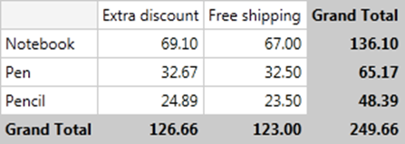
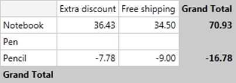
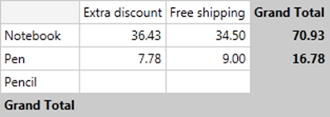
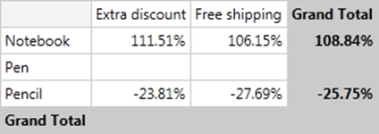
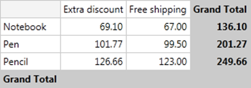
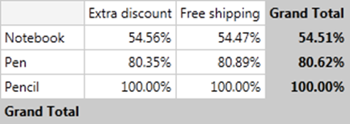
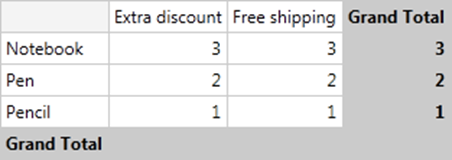

# Calculations


## 

RadPivotGrid can apply different calculations on your data. Instead of presenting the whole Total number you can show other information - for example, what percentage of the GrandTotal is the value in particular cell.

Total Calculations are applied through the **TotalFormat** property collection exposed on their **PivotGridAggregateField** class. **TotalFormat** features the following properties:

* **TotalFunction** – what type of calculation should be applied to the aggregate values

* **GroupName** – if any, which group the calculations should be performed against. For example, the DifferenceFrom operation will calculate the difference between the current aggregate value and the aggregate value for the specified group

* **Axis** – which axis the calculations should be carried out against. For instance, the DifferenceFrom operation requires a group to be specified but this group can be present both on the Rows and Columns axis.

* **Level** –sets which field to apply the calculation on - for example if you have three RowGroupFields, the first one will have level 0, second one - level 1 and the third one - level 2.

## Calculations

There are several predefined calculations that you can use. To explain each of them we will use the RadPivotGrid below and we will apply the calculations on it to show how they will modify the view of RadPivotGrid:


* **DifferenceFrom** - instead of showing Totals in the cells you can show how items differentiate from a particular group. In the example below we have set DifferenceFrom "Pen":

````ASPNET
	        <telerik:PivotGridAggregateField  Aggregate="Sum" DataField="Price">
	                   <TotalFormat TotalFunction="DifferenceFrom" Axis="Rows" Level="0"  
	                      GroupName="Pen"/>         
	        </telerik:PivotGridAggregateField>
````

You can also set DifferenceFromNext or DifferenceFromPrevious - this way each cell will show how the value in it differentiate from the value in next/previous cell. For example we can set DifferenceFromNext for our Rows and here is the result:

````ASPNET
	        <telerik:PivotGridAggregateField  Aggregate="Sum" DataField="Price">
	                   <TotalFormat TotalFunction="DifferenceFromNext" Axis="Rows" Level="0"  
	                      GroupName="Pen"/>         
	        </telerik:PivotGridAggregateField>
````



* **PercentDifferenceFrom** - the logic behind this calculation is the same as DifferenceFrom, but instead, the difference is calculated in percents.

````ASPNET
	         <telerik:PivotGridAggregateField  Aggregate="Sum" DataField="Price">
	                   <TotalFormat TotalFunction="PercentDifferenceFrom" Axis="Rows" Level="0"  
	                      GroupName="Pen"/>         
	         </telerik:PivotGridAggregateField>
````

You can also set PercentDifferenceFromNext or PercentDifferenceFromPrevious and this way the value in each cell will be the difference between its value and the value in next/previous cell, but calculated in percents.

* **Index** - calculates a weighted average by using the following formula: ((value in cell) x (Grand Total)) / ((Grand Row Total) x (Grand Column Total)). If we apply Index calculation on our example here is the result:

````ASPNET
	          <telerik:PivotGridAggregateField  Aggregate="Sum" DataField="Price">
	                   <TotalFormat TotalFunction="Index" />         
	          </telerik:PivotGridAggregateField>
````


* **PercentOf** - values in the cells are percents of a sample - for example percent of next/previous or percent of a particular group description.

* **PercentOfGrandTotal** - values in the cells are percent of the GrandTotal.

* **PercentOfColumnTotal** - values in the cells are percent of the ColumnTotal.

* **PercentOfRowTotal** - values in the cells are percent of the RowTotal.

* **RunningTotalsIn** - the value in the cell is aggregation of the value in the previous cell and the total in the current one. Last item in the collection holds the GrandTotal values. For example in the image below the value which stands for "Pen" in promotion "Extra Discount" is a sum of its own total (32.67) and the value of "Notebook" in promotion "Extra Discount" (69.10).

````ASPNET
	         <telerik:PivotGridAggregateField  Aggregate="Sum" DataField="Price">
	                   <TotalFormat TotalFunction="RunningTotalsIn" Axis="Rows" Level="0"  />         
	         </telerik:PivotGridAggregateField>
````



* **PercentRunningTotalsIn** - the value in each cell is accumulated from the total in it and the value in the previous cell. The result is presented as percent of the GrandTotal. GrandTotal is present in the last item in the collection with the value 100 percents.

````ASPNET
	         <telerik:PivotGridAggregateField  Aggregate="Sum" DataField="Price">
	                   <TotalFormat TotalFunction="PercentRunningTotalsIn" Axis="Rows" Level="0"  />         
	         </telerik:PivotGridAggregateField>
````



* **RankTotals** - the value in the cell is integer representing the rank of the current total in the current collection of totals. You can set ranking to be from smallest to largest or from largest to smallest.

````ASPNET
	         <telerik:PivotGridAggregateField  Aggregate="Sum" DataField="Price">
	                   <TotalFormat TotalFunction="RankTotals" Axis="Rows" Level="0"  />         
	        </telerik:PivotGridAggregateField>
````


