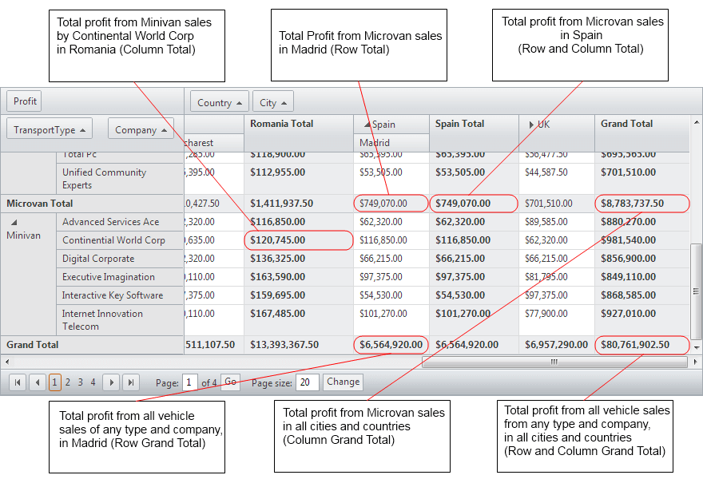

# Totals Overview

The column and row totals in RadPivotGrid sum up the aggregate results when there are two or more column or row fields declared in the control.

There are six types of totals for a given aggregate field in RadPivotGrid:

* **Row Total** - represents a total for a single row field.

* **Column Total** - represents a total for a single column field.

* **Row and Column Total** - represents a total for one row and one column field.

* **Row Grand Total** - represents a total for all row fields.

* **Column Grand Total** - represents a total for all column fields.

* **Column Grand Total** - represents a total for all column and row fields.

The below picture outlines the position and meaning of column and row totals/grand totals.

## Demonstration of the column and row totals

