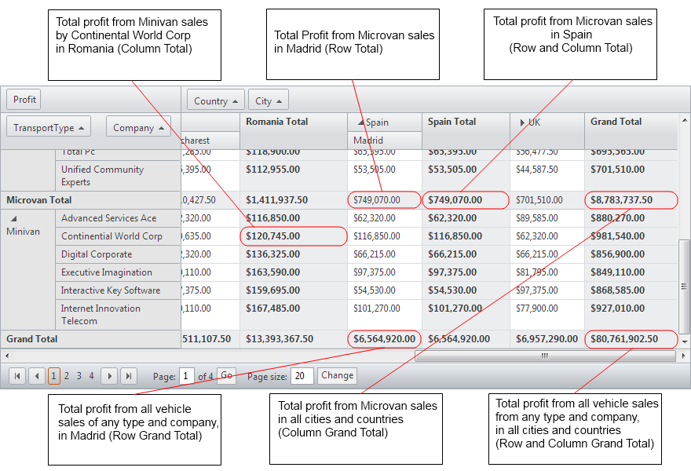

# Totals Overview

The column and row totals in RadPivotGrid sum up the aggregate results whenthere are two or more column or row fields declared in the control.

There are six types of totals for a given aggregate field in RadPivotGrid:

* __Row Total__ - represents a total for a single row field.

* __Column Total__ - represents a total for a single column field.

* __Row and Column Total__ - represents a total for one row and one column field.

* __Row Grand Total__ - represents a total for all row fields.

* __Column Grand Total__ - represents a total for all column fields.

* __Column Grand Total__ - represents a total for all column and row fields.

The below picture outlines the position and meaning of column and row totals/grand totals.

## Demonstration of the column and row totals
