# Settings

The __TotalsSettings__ class in RadPivotGrid represents a group of settings for the row and column totals visibility	and position. In this help article you can find a description of the properties and a preview the result from using them in the	different RadPivotGrid layouts.

## GroupTotalsVisibility

The __GroupTotalsVisibility__ property has four possible values: __ColumnsOnly, RowsOnly, RowsAndColumns__ and __None.__

When this property is set to __RowsOnly__, only the row grand totals will be shown.

On the other hand, when it is set to __ColumnsOnly__, the row grand totals won’t be visible, but you will still have the column totals.

The default value is __RowAndColumns__, where both row and column grand totals are visible.

Setting the value to __None__ will result in no grand totals being shown.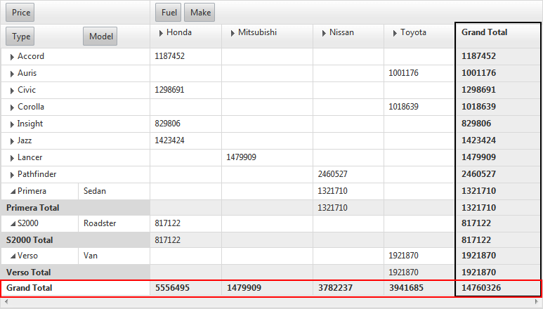

## Totals Position

The TotalsSettings class exposes four properties for controlling the totals position:

* __RowsSubTotalsPosition__

* __RowGrandTotalsPosition__

* __ColumnsSubTotalsPosition__

* __ColumnGrandTotalsPosition__

They all receive a value from the TotalsPosition enumeration, one of: __First, Last__ and __None__. *	The default value for all four properties is __Last__.*

### Cases and specifics

The position of the row sub total and grand total items into the RadPivotGrid control looks differently when the[RowTableLayout]() is changed. The behavior is similar to Excel’s PivotTable.Here are the possible cases:

* __RowsSubTotalsPosition__

* __RowsSubTotalsPosition ="First"__In this case all subtotal items are rendered before the group. Also when the group is collapsed it containsthe subtotal items values:

* *RowTableLayout="Tabular"* - NOT SUPORTED (similar to PivotTable in Excel).

* *RowTableLayout="Outline" - Expanded Group* - The group row contains allsubtotal items' values.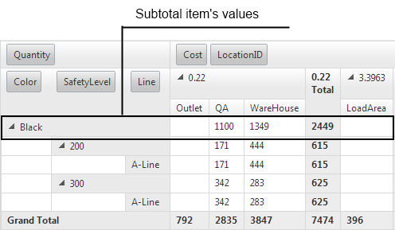

* *RowTableLayout="Outline" - Collapsed Group* - The group row contains allsubtotal item’s values.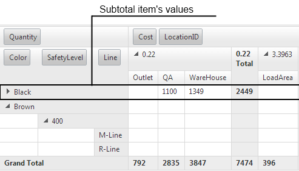

* *RowTableLayout="Compact" - Expanded Group* - The group row contains allsubtotal item’s values.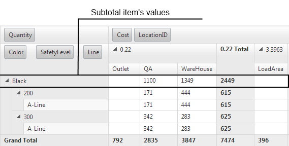

* *RowTableLayout="Compact" - Collapsed Group* - The group row contains allsubtotal item’s values.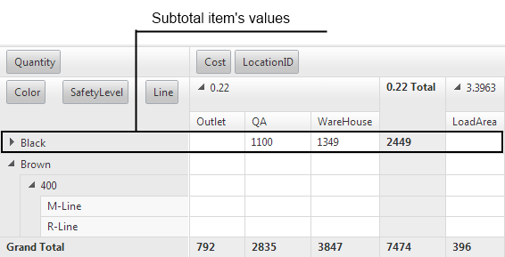

* __RowsSubTotalsPosition ="Last"__In this case all subtotal items are rendered after the group. Also when the group is collapsed it containsthe subtotal items values:

* *	RowTableLayout="Tabular" – Expanded group*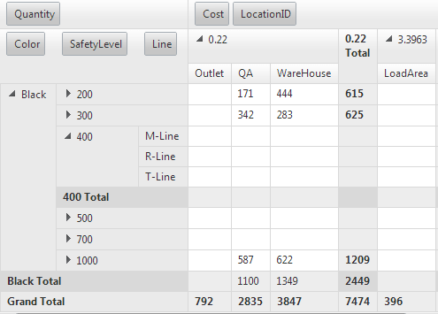

* *	RowTableLayout="Tabular" – Collapsed group* - all cells from the row contain subtotal item values.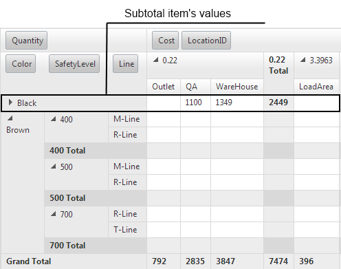

* *	RowTableLayout="Outline" – Expanded group*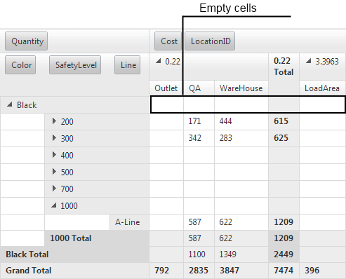

* *	RowTableLayout="Outline" – Collapsed group* - all cells from the row contain subtotal item values.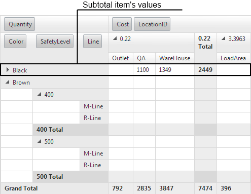

* *	RowTableLayout="Compact" – Expanded group*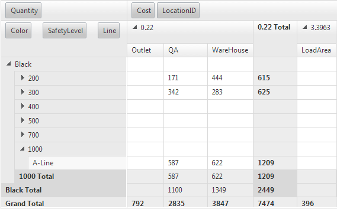

* *	RowTableLayout="Compact" – Collapsed group* - all cells from the row contain subtotal item values.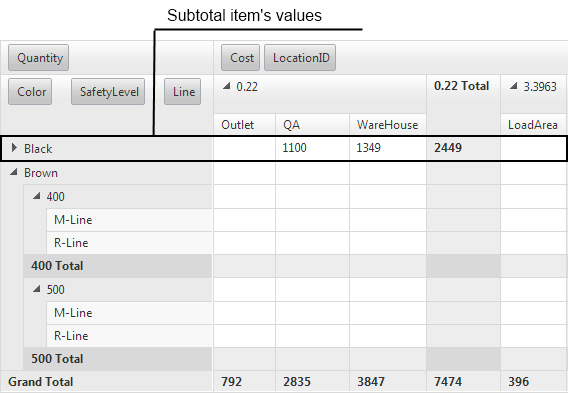

* __RowsSubTotalsPosition ="None"__In this case all subtotal items are hidden and only the grand total items are visible as last items ofthe PivotGrid. Also when the group is collapsed it contains the subtotal items values:

* *RowTableLayout="Tabular" – Expanded group*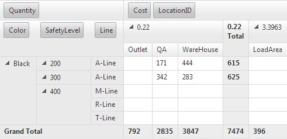

* *RowTableLayout="Tabular" – Collapsedgroup* - all cells from the rowcontain subtotal item values.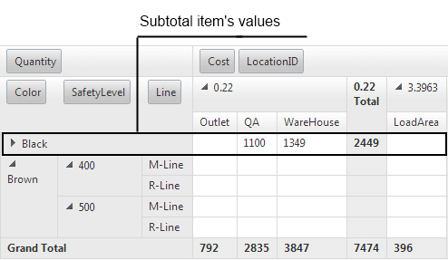

* *RowTableLayout="Outline" – Expandedgroup* - the cells from the firstrow are empty when the group is expanded.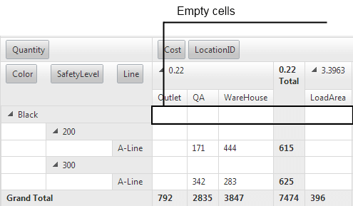

* *RowTableLayout="Outline" – Collapsedgroup* - all cells from the rowcontain subtotal item values.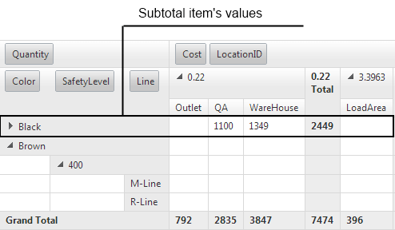

* *RowTableLayout="Compact" – Expandedgroup* - the cells from the firstrow are empty when the group is expanded.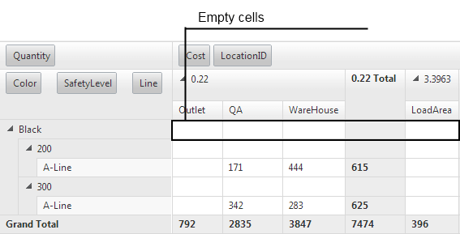

* *RowTableLayout="Compact" – Collapsedgroup* - all cells from the rowcontain subtotal item values.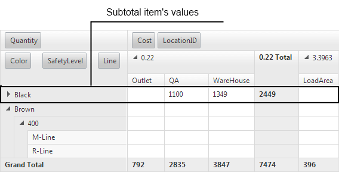

* __RowsGrandTotalsPosition__

* __RowGrandTotalsPosition="First"__In this case the grand total item is rendered as a first item:

* *RowTableLayout="Tabular"*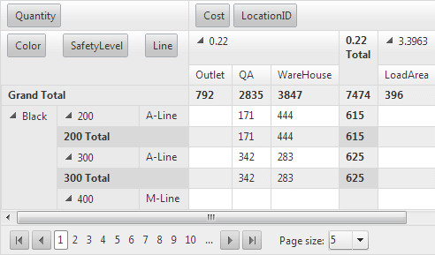

* *RowTableLayout="Outline"*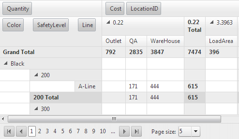

* *RowTableLayout="Compact"*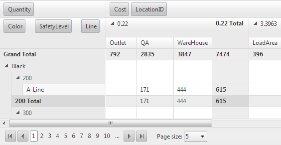

* __RowGrandTotalsPosition="Last"__In this case the grand total item is rendered as a last item:

* *RowTableLayout="Tabular"*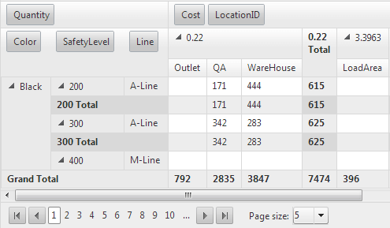

* *RowTableLayout="Outline"*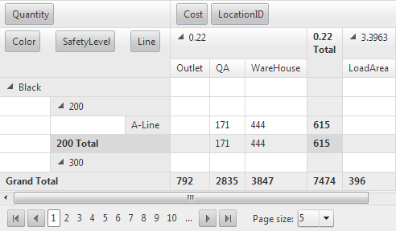

* *RowTableLayout="Compact"*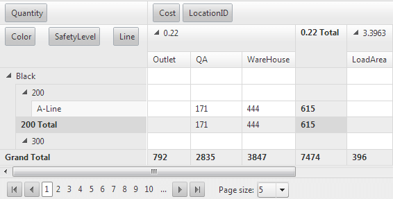

* __RowGrandTotalsPosition="None"__In this case the grand total item is not rendered.

* *RowTableLayout="Tabular"*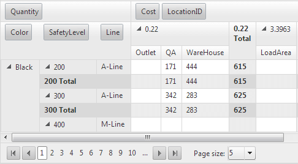

* *RowTableLayout="Outline"*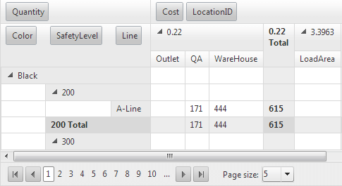

* *RowTableLayout="Compact"*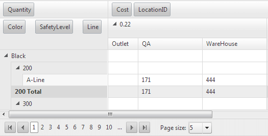

* __ColumnsSubTotalsPosition__

* __ColumnsSubTotalsPosition="First" – NOT SUPPORTED (like in Excel’s PivotTable)__

* __ColumnsSubTotalsPosition="Last"__

* *Expanded group*In this case all columns’ subtotal items are rendered after the group.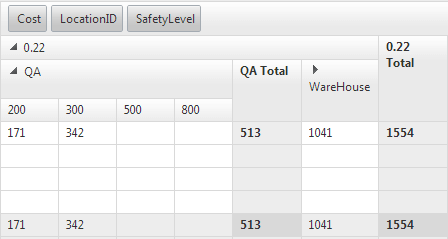

* *Collapsed group*In this case all collapsed groups contains the subtotals values: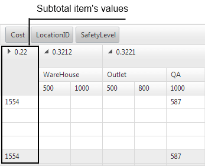

* __ColumnsSubTotalsPosition="None"__In this case all columns’ subtotal items are not rendered. Also when the group is collapsed itcontains the subtotal items values: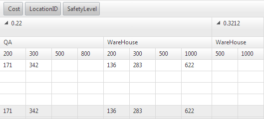

* __ColumnsGrandTotalsPosition__

* __ColumnGrandTotalsPosition="First"__In this case the column’s grand totals items are rendered as first columns.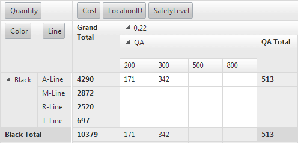

* __ColumnGrandTotalsPosition="Last"__In this case the column’s grand totals items are rendered as last columns.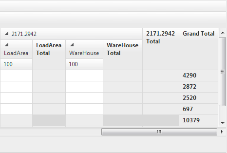

* __ColumnGrandTotalsPosition="None"__In this case the column’s grand totals items are not rendered.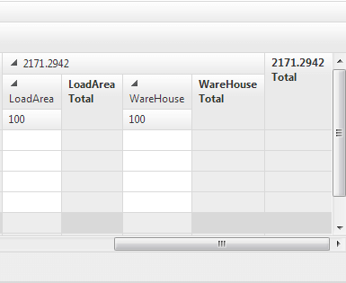
