# Settings

The **TotalsSettings** class in RadPivotGrid represents a group of settings for the row and column totals visibility	and position. In this help article you can find a description of the properties and a preview the result from using them in the	different RadPivotGrid layouts.

## GroupTotalsVisibility

The **GroupTotalsVisibility** property has four possible values: **ColumnsOnly, RowsOnly, RowsAndColumns** and **None.**

When this property is set to **RowsOnly**, only the row grand totals will be shown.

On the other hand, when it is set to **ColumnsOnly**, the row grand totals won’t be visible, but you will still have the column totals.

The default value is **RowAndColumns**, where both row and column grand totals are visible.

Setting the value to **None** will result in no grand totals being shown.

## Totals Position

The TotalsSettings class exposes four properties for controlling the totals position:

* **RowsSubTotalsPosition**

* **RowGrandTotalsPosition**

* **ColumnsSubTotalsPosition**

* **ColumnGrandTotalsPosition**

They all receive a value from the TotalsPosition enumeration, one of: **First, Last** and **None**. *	The default value for all four properties is **Last**.*

### Cases and specifics

The position of the row sub total and grand total items into the RadPivotGrid control looks differently when the [RowTableLayout]() is changed. The behavior is similar to Excel’s PivotTable.Here are the possible cases:

* **RowsSubTotalsPosition**

* **RowsSubTotalsPosition ="First"**In this case all subtotal items are rendered before the group. Also when the group is collapsed it contains the subtotal items values:

* *RowTableLayout="Tabular"* - NOT SUPORTED (similar to PivotTable in Excel).

* *RowTableLayout="Outline" - Expanded Group* - The group row contains all subtotal items' values.
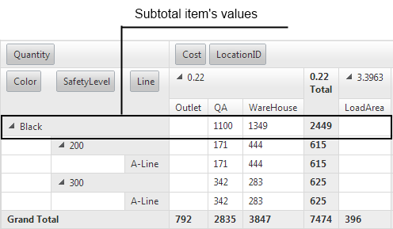

* *RowTableLayout="Outline" - Collapsed Group* - The group row contains all subtotal item’s values.
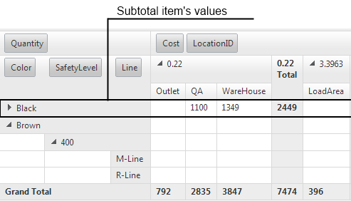

* *RowTableLayout="Compact" - Expanded Group* - The group row contains all subtotal item’s values.

* *RowTableLayout="Compact" - Collapsed Group* - The group row contains all subtotal item’s values.

* **RowsSubTotalsPosition ="Last"** In this case all subtotal items are rendered after the group. Also when the group is collapsed it contains the subtotal items values:

* *RowTableLayout="Tabular" – Expanded group*

* *RowTableLayout="Tabular" – Collapsed group* - all cells from the row contain subtotal item values.
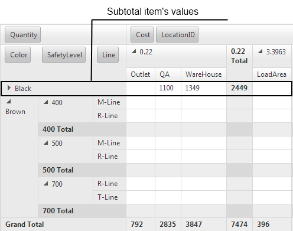

* *RowTableLayout="Outline" – Expanded group*

* *RowTableLayout="Outline" – Collapsed group* - all cells from the row contain subtotal item values.

* *RowTableLayout="Compact" – Expanded group*

* *RowTableLayout="Compact" – Collapsed group* - all cells from the row contain subtotal item values.

* **RowsSubTotalsPosition ="None"**In this case all subtotal items are hidden and only the grand total items are visible as last items ofthe PivotGrid. Also when the group is collapsed it contains the subtotal items values:

* *RowTableLayout="Tabular" – Expanded group*
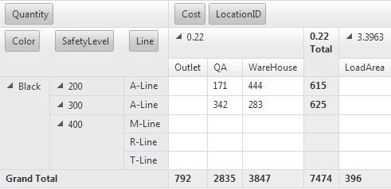

* *RowTableLayout="Tabular" – Collapsedgroup* - all cells from the rowcontain subtotal item values.
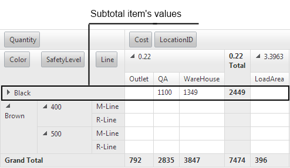

* *RowTableLayout="Outline" – Expandedgroup* - the cells from the firstrow are empty when the group is expanded.

* *RowTableLayout="Outline" – Collapsedgroup* - all cells from the rowcontain subtotal item values.

* *RowTableLayout="Compact" – Expandedgroup* - the cells from the firstrow are empty when the group is expanded.

* *RowTableLayout="Compact" – Collapsedgroup* - all cells from the rowcontain subtotal item values.
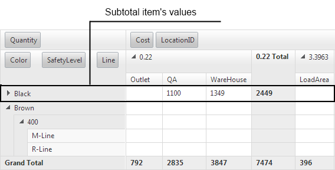

* **RowsGrandTotalsPosition**

* **RowGrandTotalsPosition="First"**In this case the grand total item is rendered as a first item:

* *RowTableLayout="Tabular"*
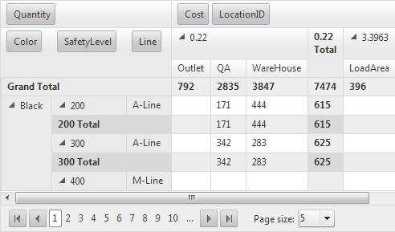

* *RowTableLayout="Outline"*
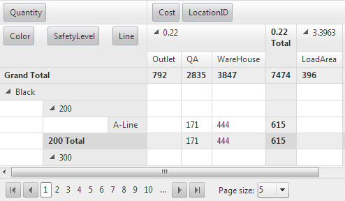

* *RowTableLayout="Compact"*
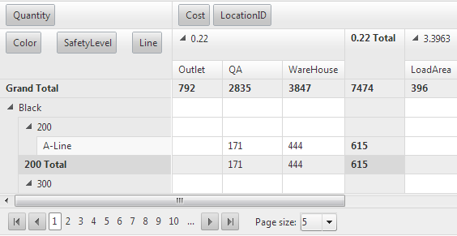

* **RowGrandTotalsPosition="Last"**In this case the grand total item is rendered as a last item:

* *RowTableLayout="Tabular"*
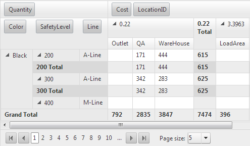

* *RowTableLayout="Outline"*
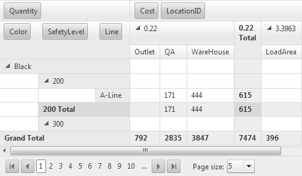

* *RowTableLayout="Compact"*
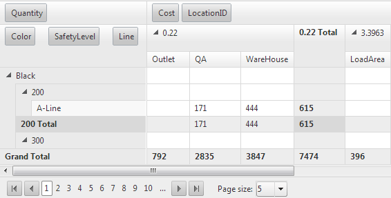

* **RowGrandTotalsPosition="None"**In this case the grand total item is not rendered.

* *RowTableLayout="Tabular"*
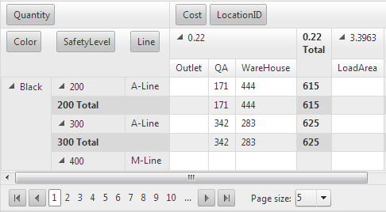

* *RowTableLayout="Outline"*
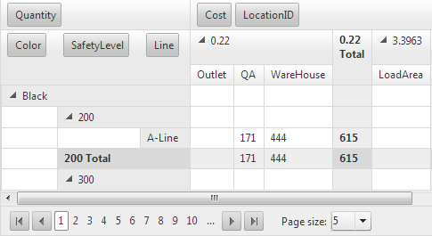

* *RowTableLayout="Compact"*
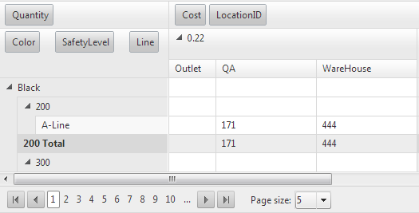

* **ColumnsSubTotalsPosition**

* **ColumnsSubTotalsPosition="First" – NOT SUPPORTED (like in Excel’s PivotTable)**

* **ColumnsSubTotalsPosition="Last"**

* *Expanded group*In this case all columns’ subtotal items are rendered after the group.
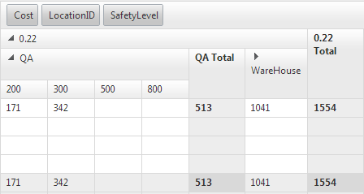

* *Collapsed group*In this case all collapsed groups contains the subtotals values:
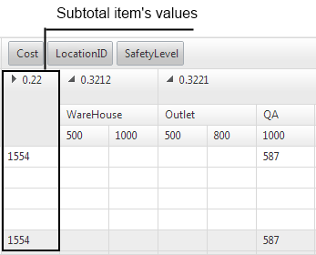

* **ColumnsSubTotalsPosition="None"**In this case all columns’ subtotal items are not rendered. Also when the group is collapsed it contains the subtotal items values:
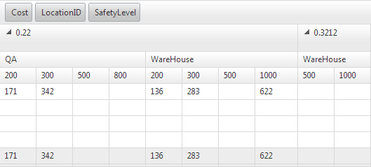

* **ColumnsGrandTotalsPosition**

* **ColumnGrandTotalsPosition="First"**In this case the column’s grand totals items are rendered as first columns.

* **ColumnGrandTotalsPosition="Last"**In this case the column’s grand totals items are rendered as last columns.

* **ColumnGrandTotalsPosition="None"**In this case the column’s grand totals items are not rendered.

