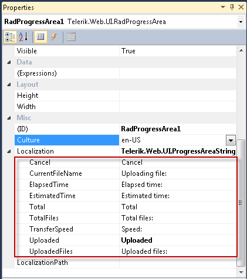
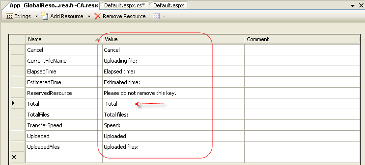
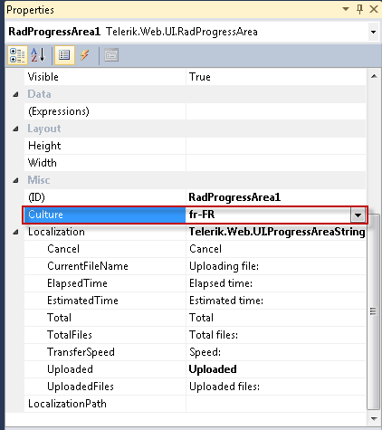

# Localizing RadProgressArea


The localization support for **Examples\progressarea-localization\** lets you completely translate the user interface, or simply adapt a few strings.

## Localization property

The **Localization** property specifies the strings that appear in the runtime user interface of **Examples\progressarea-localization\**. By changing the values of each named sub-property, you change the appearance of the string the progress area uses:

````ASPNET
<telerik:radprogressarea id="RadProgressArea1" localization-cancel="Cancel upload"
	runat="server"></telerik:radprogressarea>
````





````C#
	     
RadProgressArea1.Localization.TransferSpeed = "Speed of transfer";
				
````


>note This technique is useful when customizing some of the messages of a particular instance. The messages are not shared between ProgressArea instances. A complete translation using this approach is not appropriate.
>


>caption  

| Key | Default Value | Description |
| ------ | ------ | ------ |
|"Uploaded"|"Uploaded"|Labels the **Total Progress**  **Percent** value.This label does not appear when **ProgressIndicators** does not include "TotalProgressPercent"|
|"Total"|"Total"|Labels the **Request Size** value. This label does not appear when **ProgressIndicators** does not include "RequestSize".|
|"UploadedFiles"|"Uploaded files:"|Labels the **Files Count Percent** value. This label does not appear when **ProgressIndicators** does not include "FilesCountPercent".|
|"TotalFiles"|"Total files:"|Labels the **Selected Files Count** value. This label does not appear when **ProgressIndicators** does not include " **SelectedFilesCount** ".|
|"CurrentFileName"|"Uploading file:"|Labels the **Current File Name** . This label does not appear when **ProgressIndicators** does not include "CurrentFileName"|
|"TimeElapsed"|"Elapsed time:"|Labels the **Elapsed Time** value. This label does not appear when **ProgressIndicators** does not include "TimeElapsed".|
|"TimeEstimated"|"Estimated time:"|Labels the **Estimated Time** value. This label does not appear when **ProgressIndicators** does not include "TimeEstimated".|
|"TransferSpeed"|"Speed:"|Labels the **Speed** value. This label does not appear when **ProgressIndicators** does not include "TransferSpeed".|
|"CancelButton"|Cancel"|Labels the **Cancel** button. This label does not appear when **DisplayCancelButton** is **False** .|


## Global Resource Files

The primary means for localization in ASP.NET is to use resource files. Resource files are simple XML files that can be easily edited and transferred to other applications. You can use resource files to change the default (English) localization for **Examples\progressarea-localization\** that is stored in the Telerik.Web.UI assembly.

To create a global resource file to localize the progress area follow these steps:

1. Create the **App_GlobalResources** folder in the root of your web application. 2. Copy the default resource **Examples\progressarea-localization\.resx** file into it. This file can be found in the **App_GlobalResources** folder of the directory where you installed the RadControls. 3. Make a copy of the file and rename the copy so that its name contains the Culture Identifier. The resource files used by **Examples\progressarea-localization\** follow a strict naming convention:

**Examples\progressarea-localization\.`<Culture Identifier>`.resx**

>note The **Culture Identifier** consists of a language code followed by a dash and the country code.Example: “en-US”, “fr-CA” and so on.
>


For example Examples\progressarea-localization\.fr-CA.resx. Both files should be present in the App_GlobalResources folder:


* Edit the strings using the Visual Studio editor or your favorite text editor. Customize strings just as you would set the **Localization** property.




>caution Make sure that the **ReservedResource** message is preserved. It is used for identification purposes and is never displayed.
>


You can now switch the **Examples\progressarea-localization\** so that it uses your new resource file by setting the active **culture**:




