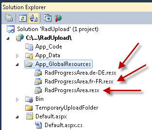
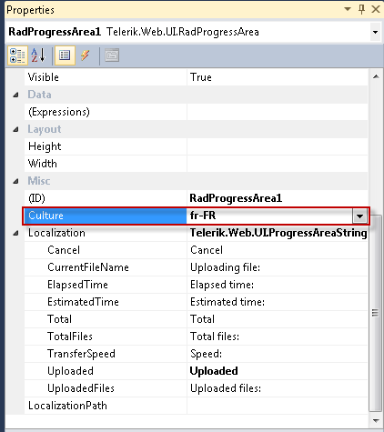

# Localizing RadProgressArea


The localization support for __Examples\progressarea-localization\__ lets you completely translate the user interface, or simply adapt a few strings.

## Localization property

The __Localization__ property specifies the strings that appear in the runtime user interface of __Examples\progressarea-localization\__. By changing the values of each named sub-property, you change the appearance of the string the progress area uses:

````ASPNET
	    <telerik:radprogressarea id="RadProgressArea1" localization-cancel="Cancel upload"
	        runat="server"></telerik:radprogressarea>
````


````C#
	     
							RadProgressArea1.Localization.TransferSpeed = "Speed of transfer";
				
````


>note This technique is useful when customizing some of the messages of a particular instance. The messages are not shared between ProgressArea instances. A complete translation using this approach is not appropriate.
>


>caption  

| Key | Default Value | Description |
| ------ | ------ | ------ |
|"Uploaded"|"Uploaded"|Labels the __Total Progress__  __Percent__ value.This label does not appear when __ProgressIndicators__ does not include "TotalProgressPercent"|
|"Total"|"Total"|Labels the __Request Size__ value. This label does not appear when __ProgressIndicators__ does not include "RequestSize".|
|"UploadedFiles"|"Uploaded files:"|Labels the __Files Count Percent__ value. This label does not appear when __ProgressIndicators__ does not include "FilesCountPercent".|
|"TotalFiles"|"Total files:"|Labels the __Selected Files Count__ value. This label does not appear when __ProgressIndicators__ does not include " __SelectedFilesCount__ ".|
|"CurrentFileName"|"Uploading file:"|Labels the __Current File Name__ . This label does not appear when __ProgressIndicators__ does not include "CurrentFileName"|
|"TimeElapsed"|"Elapsed time:"|Labels the __Elapsed Time__ value. This label does not appear when __ProgressIndicators__ does not include "TimeElapsed".|
|"TimeEstimated"|"Estimated time:"|Labels the __Estimated Time__ value. This label does not appear when __ProgressIndicators__ does not include "TimeEstimated".|
|"TransferSpeed"|"Speed:"|Labels the __Speed__ value. This label does not appear when __ProgressIndicators__ does not include "TransferSpeed".|
|"CancelButton"|Cancel"|Labels the __Cancel__ button. This label does not appear when __DisplayCancelButton__ is __False__ .|


## Global Resource Files

The primary means for localization in ASP.NET is to use resource files. Resource files are simple XML files that can be easily edited and transferred to other applications. You can use resource files to change the default (English) localization for __Examples\progressarea-localization\__ that is stored in the Telerik.Web.UI assembly.

To create a global resource file to localize the progress area follow these steps:

1. Create the __App_GlobalResources__ folder in the root of your web application. 2. Copy the default resource __Examples\progressarea-localization\.resx__ file into it. This file can be found in the __App_GlobalResources__ folder of the directory where you installed the RadControls. 3. Make a copy of the file and rename the copy so that its name contains the Culture Identifier. The resource files used by __Examples\progressarea-localization\__ follow a strict naming convention:

__Examples\progressarea-localization\.<Culture Identifier>.resx__

>note The __Culture Identifier__ consists of a language code followed by a dash and the country code.Example: “en-US”, “fr-CA” and so on.
>


For example Examples\progressarea-localization\.fr-CA.resx. Both files should be present in the App_GlobalResources folder:




4. Edit the strings using the Visual Studio editor or your favorite text editor. Customize strings just as you would set the __Localization__ property.


>caution Make sure that the __ReservedResource__ message is preserved. It is used for identification purposes and is never displayed.
>


You can now switch the __Examples\progressarea-localization\__ so that it uses your new resource file by setting the active __culture__:




