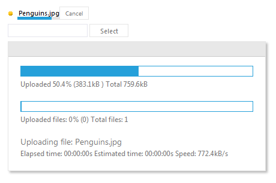

# WebForms ProgressArea Overview

RadProgressArea control provides support for custom progress monitoring. It can be used together with any upload control - the simple HTML tag, Microsoft’s default control or Telerik’s RadAsyncUpload control, to display file upload progress in a rich and highly customizable manner. The progress bar can be adapted to any application's design thanks to the 20 built-in skins or define your own templates for custom look and feel.

## RadProgressArea Basic Usage

The following example shows the basic usage of **RadProgressArea** with RadAsyncUpload:

````ASPNET
<telerik:RadAsyncUpload RenderMode="Lightweight" ID="RadAsyncUpload1" runat="server"></telerik:RadAsyncUpload>
<telerik:RadProgressArea RenderMode="Lightweight" ID="RadProgressArea1" runat="server"></telerik:RadProgressArea>			
````


## Example


## Quick Links

[Customization with Templates](https://demos.telerik.com/aspnet-ajax/progressarea/examples/progresstemplate/defaultcs.aspx "Customization with Templates")

[Integration with AsyncUpload](https://demos.telerik.com/aspnet-ajax/progressarea/examples/asyncuploadintegration/defaultcs.aspx "Integration with AsyncUpload")

[Integration with Input Type File](https://demos.telerik.com/aspnet-ajax/progressarea/examples/inputtypefileintegration/defaultcs.aspx "Integration with Input Type File")

## Key Features

1. Progress Monitoring of Measurable Processes

2. File Upload Process Visualization

3. Templates for Easy Customization

## Known Limitations

1. RadProgressArea is not displayed under Medium Trust level.

2. RadProgressArea alone is not supported in SharePoint, but you can use it in combination with RadAsyncUpload.


## See Also

 * [Online Demos](https://demos.telerik.com/aspnet-ajax/progressarea/examples/customprogress/defaultcs.aspx)
 
 * [Telerik UI for ASP.NET AJAX Components](https://www.telerik.com/products/aspnet-ajax.aspx)
