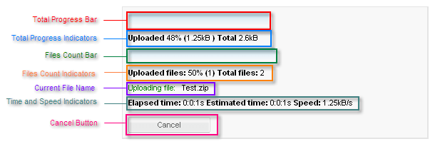

# Structure

## 

The structure of the __RadProgressArea__ progress dialog is shown below:

Every element of the dialog can be optionally removed.

* The __Total Progress Bar__ gives a graphical representation of how much of the upload has completed, based on the request size. It appears when the __ProgressIndicators__ property includes "TotalProgressBar".

* The __Total Progress Indicators__ include (in order)

1. Total Progress Percent (the percentage of the request that is complete)

1. Total Progress (the total number of bytes already uploaded)

1. Request Size (the total number of bytes to upload)These indicators appear when the __ProgressIndicators__ property includes "TotalProgressPercent", "TotalProgress", and "RequestSize", respectively.

* The __Files Count Bar__ gives a graphical representation of how much of the upload has completed, based on the number of files. It appears when the __ProgressIndicators__ property includes "FilesCountBar".

* The __Files Count Indicators__ include (in order)

1. Files Count Percent (the percentage of the requested files that have been uploaded)

1. Files Count(the number of files that have been uploaded)

1. Selected Files Count (the total number of files to upload)These indicators appear when the __ProgressIndicators__ property includes "FilesCountPercent", "FilesCount", and "SelectedFilesCount", respectively.

* The __Current File Name__ gives the name of the file currently being uploaded. This is included when the __ProgressIndicators__ property includes "CurrentFileName".

* The __Time and Speed Indicators__ include (in order).

1. Elapsed Time (the time that has already elapsed servicing the upload request)

1. Estimated Time (the estimated amount of time remaining )

1. Speed (the speed of the process)These indicators appear when the __ProgressIndicators__ property includes "TimeElapsed", "TimeEstimated", and "TransferSpeed", respectively.

* The __Cancel Button__ lets the user cancel length upload processes. It appears when the __DisplayCancelButton__ property is set to __True__.

# See Also

 * [Configuraton]()
