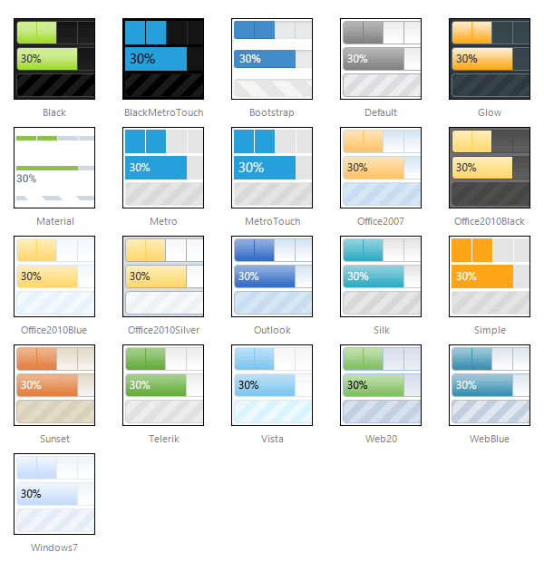

# Skins

**RadProgressBar** uses **skins** to control its overall look-and-feel. A skin is a set of images and a CSS stylesheet that can be applied to the control elements (items, images, etc.) and defines their appearance.

To apply a skin to a **RadProgressBar** control, set its **Skin** property.

**RadProgressBar** is installed with a number of preset skins. These are shown below:

 

 @[template - Material skin is available only in Lightweight mode](/_templates/common/skins-notes.md#material-only-in-lightweight) 

## See Also

 * [ASP.NET ProgressBar Control Product Overview]()

 * [RadProgressBar Getting Started]()

 * [Telerik ThemeBuilder for ASP.NET AJAX](https://themebuilder.telerik.com/)

