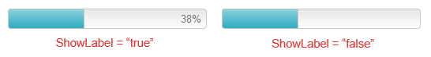
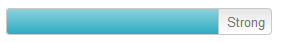

# Custom Label 

The RadProgressBar's **Label** is the message (word, number, percent) that displays the level of process completion. This article explains the default status	label of the control, how to customize its text or how to hide it.

>note The Label functionality is supported only for **Value** and **Percent** RadProgressBar[types]().

## Use the Default Progress Label

By default, the ProgressBar's **Label** displays the current **Value** of the [progress indicator](), when the control’s **BarType** is either *Value* or *Percent*. You can hide the **Label** by setting the **ShowLabel** property to **false**.

>caption Figure 1: RadProgressBar with enabled and disabled Label visibility.



>caption Example 1: Configure the visibility of the progress Label in a RadProgressBar with value in percent. The result of this example is displayed in **Figure 1**.

````ASP.NET
<telerik:RadProgressBar RenderMode="Lightweight" runat="server" ID="RadProgressBar1" Value="38" Skin="Silk" BarType="Percent" Width="250px" ShowLabel="true" >
</telerik:RadProgressBar>
<telerik:RadProgressBar RenderMode="Lightweight" runat="server" ID="RadProgressBar2" Value="38" Skin="Silk" BarType="Percent" Width="250px" ShowLabel="false">
</telerik:RadProgressBar>
````


## Use a Custom Progress Label

If you want to customize the displayed label, you can show the desired progress message by configuring the **RadProgressBar**’s **Label** property (see **Example 2**). You can also see how to change the **Label** values dynamically client-side in the [Custom Label](https://demos.telerik.com/aspnet-ajax/progress-bar/functionality/custom-label/defaultcs.aspx) demo.

>caption Figure 2: RadProgressBar displaying a custom progress label.



>caption Example 2: Configure RadProgressBar to display a custom progress label. The result of this example is displayed in **Figure 2**.

````ASP.NET
<telerik:RadProgressBar RenderMode="Lightweight" runat="server" Width="264px" ID="PasswordStrengtProgress" 
	MaxValue="10" Value="8" ShowLabel="true" Label="Strong" Skin="Silk">
</telerik:RadProgressBar>
````

## See Also

 * [RadProgressBar Custom Label Demo](https://demos.telerik.com/aspnet-ajax/progress-bar/functionality/custom-label/defaultcs.aspx)

 * [Overview]()

 * [Types]()

 * [RadProgressBar Client-side API]()
