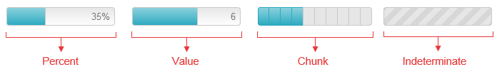

# Types

This article explains the different **RadProgressBar** types (**Figure 1**) and how to configure them.

>caption Figure 0: The four different progress bar types.



The level of process completion is represented by the filled part of the progress bar (the [progress indicator]()).

The current progress state can be visualized in different ways depending on the value passed to the control’s **BarType** property. The possible options are:

* **Percent**
* **Value**
* **Chunk**

Furthermore, if you cannot have a precise indication of the progress, you can use the control in indeterminate state by configuring its **Indeterminate** property.

## Percent

The progress indicator in **Percent** mode (**Figure 1**) shows the progress as a part of the 100% the **MaxValue** property of the **ProgressBar** denotes.

You can also use the **RadProgressBar** in percent mode as a label which shows the completion of the task or some custom text. You can use a [custom label]() when the **RadProgressBar** is used in this mode.

>caption Figure 1: ProgressBar with a value shown in percent.


>caption Example 1: Configure RadProgressBar in Percent mode.

````ASP.NET
<telerik:RadProgressBar runat="server" ID="RadProgressBar1" BarType="Percent" Width="300" ShowStatus="true" Skin="WebBlue"
	MaxValue="100" Value="35" >
</telerik:RadProgressBar>
````


## Value

The progress bar in **Value** mode (**Figure 2**) is similar to the Percent bar type, but you can control the max progress value.For example, you can have a progress value equal to 6 out of 10 (see **Figure 2** which is produced by **Example 2**).You can use a [custom label]() when the **RadProgressBar** is used in this mode.

>caption Figure 2: ProgressBar with a current value.


>caption Example 2: Configure **RadProgressBar** in **Value** mode.

````ASP.NET
<telerik:RadProgressBar runat="server" ID="RadProgressBar2" BarType="Value" Width="300" ShowStatus="true"
	MaxValue="10" Value="6" Skin="Silk">
</telerik:RadProgressBar>
````


## Chunk

The progress bar in **Chunk** mode (**Figure 3**) is divided in equal pieces (chunks) which display the completed discrete process steps. For example, if a form has 5required inputs or a wizard is completed in 5 steps, the progress bar should be defined in 5 chunks. If two steps are completed, the first two chunks should be filled(see **Figure 3** which is created by **Example 3**).

>note If you want to set the current step trough the **Value** of the progress bar easily, you should set equal values to the control's **MaxValue** and **ChunksCount** properties. The default value of the **MaxValue** property is 100.

>caption Figure 3: ProgressBar with a predefined set of 5 steps, two of which are completed.


>caption Example 3: Configure RadProgressBar in Chunk mode.

````ASP.NET
<telerik:RadProgressBar runat="server" ID="RadProgressBar3" BarType="Chunk" Width="300" ChunksCount="5" MaxValue="5" Value="2" Skin="WebBlue">
</telerik:RadProgressBar>
````


## Indeterminate

The **Indeterminate** type of progress bar (**Figure 4**) is used in situations where the estimation ofthe task is unknown or the progress of the task cannot be determined in a way that could be expressed as a tangible value. This bar type uses	motion to show that progress is taking place, rather than using the size of the filled portion to show the quantitative progress.

There are two possible ways to make a **RadProgressBar** indeterminate:

* By setting its **Indeterminate** property to `true` (see **Example 3**).

* By passing `false` as an argument to the ProgressBar’s **set_value()** [client-side method]() (see **Example 4**).With this approach the progress bar will become indeterminate no matter what its current **BarType** is.

>caption Figure 4: ProgressBar in Indeterminate State.


>caption Example 3: Configure RadProgressBar in Indeterminate mode in the mark-up.

````ASP.NET
<telerik:RadProgressBar runat="server" ID="RadProgressBar4" Indeterminate="true">
</telerik:RadProgressBar>
````


>caption Example 4: Configure RadProgressBar in Indeterminate mode with JavaScript.

````ASP.NET
<telerik:RadProgressBar runat="server" ID="RadProgressBar5" BarType="Percent" Value="35">
</telerik:RadProgressBar>
<script>
	Sys.Application.add_load(
		function () {
			$find("<%= RadProgressBar5.ClientID %>").set_value(false);
		})
</script>
````


## See Also

 * [Overview]()

 * [Server-side Programming]()

 * [RadProgressBar Object]()

 * [Element Structure]()
