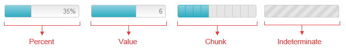

# Types


This article explains the different __RadProgressBar__ types (__Figure 1__) and how to configure them.
>caption Figure 0: The four different progress bar types.



The level of process completion is represented by the filled part of the progress bar (the [progress indicator]()).

The current progress state can be visualized in different ways depending on the value passed to the control’s __BarType__ property. The possible options are:

* __Percent__

* __Value__

* __Chunk__

Furthermore, if you cannot have a precise indication of the progress, you can use the control in indeterminate state by configuring its __Indeterminate__ property.

## Percent

The progress indicator in __Percent__ mode (__Figure 1__) shows the progress as a part of the 100% the__MaxValue__ property of the __ProgressBar__ denotes.

You can also use the __RadProgressBar__ in percent mode as a label which shows the completion of the taskor some custom text. You can use a [custom label]() when the __RadProgressBar__ is used inthis mode.
>caption Figure 1: ProgressBar with a value shown in percent.


__Example 1__: Configure RadProgressBar in Percent mode.

````ASPNET
			<telerik:RadProgressBar runat="server" ID="RadProgressBar1" BarType="Percent" Width="300" ShowStatus="true" Skin="WebBlue"
				MaxValue="100" Value="35" >
			</telerik:RadProgressBar>
````


## Value

The progress bar in __Value__ mode (__Figure 2__) is similar to the Percent bar type, but you can control the max progress value.For example, you can have a progress value equal to 6 out of 10 (see __Figure 2__ which is produced by __Example 2__).You can use a [custom label]() when the __RadProgressBar__ is used in this mode.
>caption Figure 2: ProgressBar with a current value.


__Example 2__: Configure __RadProgressBar__ in __Value__ mode.

````ASPNET
			<telerik:RadProgressBar runat="server" ID="RadProgressBar2" BarType="Value" Width="300" ShowStatus="true"
				MaxValue="10" Value="6" Skin="Silk">
			</telerik:RadProgressBar>
````


## Chunk

The progress bar in __Chunk__ mode (__Figure 3__) is divided in equal pieces (chunks) which display the completed discrete process steps. For example, if a form has 5required inputs or a wizard is completed in 5 steps, the progress bar should be defined in 5 chunks. If two steps are completed, the first two chunks should be filled(see__Figure 3__ which is created by __Example 3__).

>note If you want to set the current step thorugh the __Value__ of the progress bar easily, you should set equal values to the control's __MaxValue__ and __ChunksCount__ properties. The default value of the __MaxValue__ property is 100.
>

>caption Figure 3: ProgressBar with a predefined set of 5 steps, two of which are completed.


__Example 3__: Configure RadProgressBar in Chunk mode.

````ASPNET
			<telerik:RadProgressBar runat="server" ID="RadProgressBar3" BarType="Chunk" Width="300" ChunksCount="5" MaxValue="5" Value="2" Skin="WebBlue">
			</telerik:RadProgressBar>
````


## Indeterminate

The __Indeterminate__ type of progress bar (__Figure 4__) is used in situations where the estimation ofthe task is unknown or the progress of the task cannot be determined in a way that could be expressed as a tangible value. This bar type uses	motion to show that progress is taking place, rather than using the size of the filled portion to show the quantitative progress.

There are two possible ways to make a __RadProgressBar__ indeterminate:

* By setting its __Indeterminate__ property to `true` (see __Example 3__).

* By passing `false` as an argument to the ProgressBar’s __set_value()__[client-side method]() (see __Example 4__).With this approach the progress bar will become indeterminate no matter what its current __BarType__ is.
>caption Figure 4: ProgressBar in Indeterminate State.


__Example 3__: Configure RadProgressBar in Indeterminate mode in the mark-up.

````ASPNET
			<telerik:RadProgressBar runat="server" ID="RadProgressBar4" Indeterminate="true">
			</telerik:RadProgressBar>
````


__Example 4__: Configure RadProgressBar in Indeterminate mode with Javascript.

````ASPNET
			<telerik:RadProgressBar runat="server" ID="RadProgressBar5" BarType="Percent" Value="35">
			</telerik:RadProgressBar>
			<script>
				Sys.Application.add_load(
					function () {
						$find("<%= RadProgressBar5.ClientID %>").set_value(false);
					})
			</script>
````


# See Also

 * [Overview]()

 * [Server-side Programming]()

 * [RadProgressBar Object]()

 * [Element Structure]()
