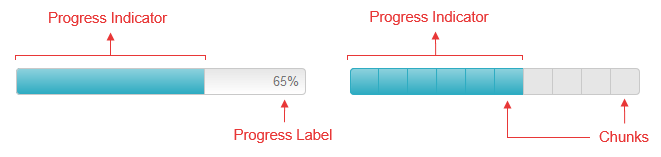

# Element Structure

In this article you can find the names of the **RadProgressBar** UI elements (**Figure 1**) and learn more about their purpose.

## 
>caption Figure 1: RadProgressBar Element Structure

### Progress Indicator

The progress indicator is a bar that is filledas an operation progresses (by default from the left to the right). Depending on the value passed to the progress bar’s **BarType** property, the current progress status can be displayed as [percent or value]().

### Progress Label

This is the label that displays the level of process completion. The built-in progress label is supported only when the control is used in[Percent or Value]() mode .

### Chunks

The chunks represent the equal pieces in which the progress bar can be divided. They illustrate the completed steps from a quantitative process.

# See Also

 * [Overview]()

 * [Types]()
