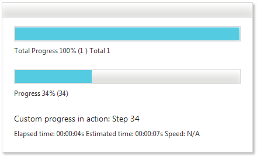

# RadProgressBar vs. RadProgressArea Comparison

This article explains the differences between the **RadProgressBar** and **RadProgressArea** controls from the Telerik® UI for ASP.NET AJAX suite.

>caption Figure 1: RadProgressBar control

>caption Figure 2: RadProgressArea control

Even though **RadProgressBar** and **RadProgressArea** appear to be similar (because you can use both of the controls for monitoring and visualizing the progress of a measurable operation) they have a number of differences that make each of the controls more suitable for particular scenarios.

**RadProgressBar** has simplified layout and it makes maximum use of CSS3 to decrease the size of the skins and the amount of data that the client browser should request. It contains only a bar element and a label, so you can start using it with a simple measurable process by making almost no changes in its configuration. Tracking a more complex process would require adding custom indicator elements. Also, the progress bar control has to be updated manually on the client or on the server because it does not automatically request data from the process, to which it is attached.

**RadProgressArea** is designed for file upload and for monitoring more complex processes that include a lot of data. As a result, it contains a lot of indicator elements for visualizing the file upload and you need to customize it a bit to track a simpler process. You can easily [ integrate it with RadAsyncUpload ](https://demos.telerik.com/aspnet-ajax/progressarea/examples/asyncuploadintegration/defaultcs.aspx), a FileUpload control or an input of type file to visualize the file upload process. The progress area control can automatically track any measurable process on the server when you add a **RadProgressManager** on the page. It also supports manual updates that require sending information for all visible indicators.

>caption Table 1: Comparison between the main features of RadProgressBar and RadProgressArea.

|  **Feature**  |  **RadProgressBar**  |  **RadProgressArea**  |
| ------ | ------ | ------ |
|Lightweight Rendering|Yes (by design)|No|
|Percent Mode|Yes|Yes|
|Value Mode|Yes|No|
|Chunk Mode|Yes|No|
|Indeterminate Mode|Yes|No|
|Updating Of Progress|Manual|Manual, Automatic With RadAsyncUpload, Automatic With RadProgressManager And Any Measurable Server Process|
|Progress Monitoring|Any Measurable Processes|Any Measurable Processes, Integration With RadAsyncUpload|
|Progress Indicators|Customizable Progress Label|Current Progress, Total Progress, Estimated Time And Speed, Files Count And Current File Name|
|Rich Client-Side API|Yes|Yes|
|Client-Side Events|Yes|Yes|
|Skins|Yes|Yes|
|Cross-Browser Support|Yes|Yes|
|Orientation|Yes|No|
|Right-to-Left Support|Yes|Yes|
|Requires Registration Of HTTP Handler|No|Yes|

## See Also

[RadProgressArea Overview]()
