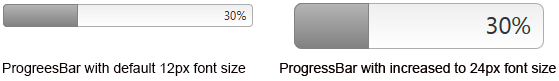

# Elastic Design

This article explains the **elastic design capabilities RadProgressBar offers**. RadProgressBar is built semantically, using CSS for defining rounded corners, shadows and gradients. The example bellow shows the simple approach you can use to to resize and scale the control by only changing its default font size.

@[template](/_templates/common/render-mode.md#resp-design-desc "slug-el: no, slug-fl: progressbar/mobile-support/fluid-design")

@[template](/_templates/common/font-size-notes.md#note-and-example "control: RadProgressBar")

## Elastic Design with RadProgressBar

>caption Figure 1: Comparison between a RadProgressBar with the default 12px font size and with increased font-size



**RadProgressBar** does not create elastic design by itself, but can fit in a page that follows this pattern.This means that you can change its font size without breaking the control's appearance - if the new size is larger than the original,the elements in the control will simply increase their size.This fluid layout is achieved by using `em` units for setting dimensions and paddings in the control,instead of `px` because em units are tied to the font size. This allows dimensions and sizes to scale with the font size.

>caption Example 1: How to increase the font size of a RadProgressBar as shown in Figure 1.

````ASP.NET
<style type="text/css">
	div.RadProgressBar
	{
		font-size: 24px;
	}
</style>
<telerik:RadProgressBar runat="server" Value="30" ID="RadProgressBar11" BarType="Percent" Width="250px" />
````

## See Also

 * [Fluid Design]()

@[template](/_templates/common/font-size-notes.md#related-resources)