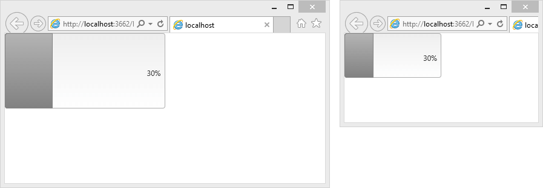

# Fluid Design

This article explains the **fluid design capabilities RadProgressBar offers**.	RadProgressBar is built semantically, using CSS for defining rounded corners, shadows and gradients.	The example bellow shows how you can set its size in percent so it can resize with its parent element.

@[template](/_templates/common/render-mode.md#resp-design-desc "slug-el: progressbar/mobile-support/elastic-design, slug-fl: no")

## Fluid Design with RadProgressBar

>caption Figure 1: RadProgressBar with dimensions set to 100% that occupies its entire parent element



You can set the **Width** and **Height** properties of the **RadProgressBar** in **percent**.	This lets it resize together with its parent element size. The control is usually used with its default height and so the value label is designed	for this scenario. To accommodate heights that can change, you can override some of its CSS rules as shown in **Example 1**.

>caption Example 1: Markup and CSS that provide a fluid RadProgressBar that changes size with the browser view-port

````ASP.NET
<style type="text/css">
	html, body, form
	{
		margin: 0;
		padding: 0;
		height: 100%;
	}

	.fluidProgressBar .rpbLabelWrapper .rpbLabel
	{
		position: absolute;
		right: 0;
		top: 50%;
		margin-top: -0.5em;
	}
</style>
<div style="width: 50%; height: 50%">
	<telerik:RadProgressBar RenderMode="Lightweight" Width="100%" Height="100%" CssClass="fluidProgressBar" runat="server" Value="30" ID="RadProgressBar1" BarType="Percent" />
</div>
````

## See Also

 * [Elastic Design]()
