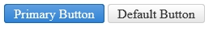

# Primary Action Button

**RadPushButton** can be a Primary Action Button (**Figure 1**).

The primary action button on the form has bright and saturated colors to pop up more and catch attention easily. You should use a primary action button to make the default/preferred/main/safe operation on the form stand out. At this point the rest of the buttons with their default appearance become Secondary Action buttons and do not draw as much attention.

>caption Figure 1: Primary RadPushButton next to a default RadPushButton.



To switch to a primary action button, set the `Primary` property of the **RadPushButton** control to `true` (**Example 1**). The property defaults to `false` result in the regular (secondary) button appearance for most cases.

>caption Example 1: Configure a RadPushButton to be a primary action button.

````ASP.NET
<telerik:RadPushButton runat="server" ID="RadPushButton1" Primary="true" Text="Primary Button"></telerik:RadPushButton>
<telerik:RadPushButton runat="server" ID="RadPushButton2" Text="Default Button"></telerik:RadPushButton>
````


## See Also

 * [Skins]()

 * [Create a Custom Skin]()
