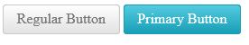

# Primary State

**RadPushButton** offers an additional "primary" state (**Figure 1**) that uses bright and saturated colors to have the button pop up more and catch attention easily.

>caption Figure 1: RadPushButton in its regular and primary state.



To switch to the primary state, set the `Primary` property of the **RadPushButton** control to `true` (**Example 1**). The property defaults to `false` result in the regular button appearance for most cases.

>caption Example 1: Configure the primary state of a RadPushButton instance.

````ASP.NET
<telerik:RadPushButton runat="server" ID="RadPushButton1" Text="Regular Button" Skin="Silk"></telerik:RadPushButton>
<telerik:RadPushButton runat="server" ID="RadPushButton2" Primary="true" Text="Primary Button" Skin="Silk"></telerik:RadPushButton>
````


## See Also

 * [Skins]()

 * [Create a Custom Skin]()
