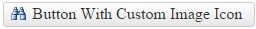
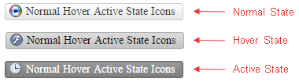
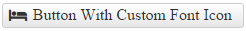

# Custom Icons

This help article shows how to use custom icons (images or font icons) in **RadPushButton**.

* [Image Icons](#image-icons)

* [Font Icons](#font-icons)

## Image Icons

To display an image icon on the button, you need to set the **Icon.Url** property.

>caption Figure 1: RadPushButton with custom icon set through the **Icon.Url** property.



>caption Example 1: Configure a **RadPushButton** with an icon through the **Icon.Url** property.

````ASP.NET
<telerik:RadPushButton ID="RadPushButton1" runat="server" Text="Button With Custom Image Icon">
	<Icon Url="http://demos.telerik.com/aspnet-ajax/button/examples/customicons/images/eFind.png" Top="5" Left="8" />
</telerik:RadPushButton>
````

**RadPushButton** also provides an easy way to show different icon when the mouse is over the control, or the button is pressed (see **Figure 2** and **Example 2**). To do this, use the **HoveredCssClass** and **PressedCssClass** properties exposed by the **Icon** tag.

>caption Figure 2: A RadPushButton can have different icons for its normal, hovered and active state.



**Example 2:** Setup unique icons for the normal, hovered and active state of a **RadPushButton**.

````ASP.NET
<telerik:RadPushButton ID="RadPushButton1" runat="server" Text="Normal Hover Active State Icons">
	<Icon Url="http://demos.telerik.com/aspnet-ajax/button/examples/customicons/images/ePlayer.png"
		HoveredUrl="http://demos.telerik.com/aspnet-ajax/button/examples/customicons/images/eFlash.png"
		PressedUrl="http://demos.telerik.com/aspnet-ajax/button/examples/customicons/images/eTime.png" />
</telerik:RadPushButton>
````

## Font Icons

You can use custom font icons in **RadPushButton** as well. To do that, follow the steps below:

1. Load the stylesheet with the desired font icons on the page.

1. Override the font-family of the button's icon element with the target one (see **Example 3**)(COMMENT: Consider showing sample snippets directly in the list instead of only an exapmle with FontAwesome).

1. Set the custom font icon class to the **Icon.CssClass** property.

You can find below an example with [Font Awesome Icons](https://fortawesome.github.io/Font-Awesome/icons/).

>caption Figure 3: RadPushButton with Font Awesome icon.



**Example 3:** Using FontAwesome font icons in RadPushButton.

````CSS
<link rel="stylesheet" href="//maxcdn.bootstrapcdn.com/font-awesome/4.3.0/css/font-awesome.min.css" />
<style>
	.RadButton.fa .rbIcon:before {
		font-family: FontAwesome;
	}
</style>
````

````ASP.NET
<telerik:RadPushButton ID="RadButton1" runat="server" Text="Button With Custom Font Icon" CssClass="fa">
	<Icon CssClass="fa-bed" />
</telerik:RadPushButton>
````

You can also change the font-size and color of the font icon - [Configure Icon Font-size and Color](#configure-icon-font-size-and-color).

## See Also

 * [PushButton - Custom Icons Demo](http://demos.telerik.com/aspnet-ajax/pushbutton/functionality/custom-icons/defaultcs.aspx)

 * [Font Awesome Icons](https://fortawesome.github.io/Font-Awesome/icons/)
 
 * [PushButton - Embedded Icons Demo](http://demos.telerik.com/aspnet-ajax/pushbutton/functionality/embedded-icons/defaultcs.aspx)
 
 * [Icons Overview]()
 
 * [Configure Icon Font-size and Color](#configure-icon-font-size-and-color)
 
 