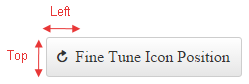

# Icons Overview

This help article shows how to use icons in **RadPushButton**. You can use the built-in font icons or your own images for its different states and even fine tune their position.

* [Use Embedded Icons](#use-embedded-icons)

* [Fine-tune Icon Position](#fine-tune-icon-position)

* [Configure Icon Font-size and Color](#configure-icon-font-size-and-color)

## Use Embedded Icons

To make the control easier to use **Telerik** provides a large set of built-in icons (**Figure 2**). To use them, set the **Icon.CssClass** property (**Example 1**) to one of the predefined CSS class names, and the respective icon will be shown on the control. The full list of the CSS classes can be found in **List 1**.

>caption Figure 1: RadPushButton with an embedded icon (Icon.CssClass="rbOk") from Example 1.


>caption Example 1: Declaration of embedded icon in RadPushButton.

````ASP.NET
<telerik:RadPushButton ID="RadPushButton1" runat="server" Text="Button with Icon" Skin="Default">
	<Icon CssClass="rbOk" />
</telerik:RadPushButton>
````

>caption List 1: CSS classes of embedded icons in **RadPushButton** shown in **Figure 1**.

* rbAdd
* rbRemove
* rbOk
* rbCancel
* rbUpload
* rbDownload
* rbPrevious
* rbNext
* rbOpen
* rbAttach
* rbSave
* rbConfig
* rbPrint
* rbRefresh
* rbSearch
* rbHelp
* rbCart
* rbEdit
* rbRSS
* rbMail
* rbFB
* rbTwitter

The color of the predefined icons can be white or black, depending on the chosen Skin. You can make the difference for the **Silk** and **Glow** skin in **Figure 2**.

>caption Figure 2: Embedded icons in RadPushButton for the Silk and Glow skin have white and black colors.


>note The **CssClass** is composed in the following way: [**r**]ad[**b**]utton[**IconName**]. For example **rbAdd**.

<!--
The code that creates Figure 3
ASPX:
<style type="text/css">
	/*Format tables*/
	tr:first-child {
		font-weight: bold;
	}

	tr:nth-child(odd) {
		background: #efefef;
	}

	td {
		border: 1px solid #ddd;
	}

	table {
		display: inline;
		float: left;
	}
</style>

<telerik:RadScriptManager ID="RadScriptManager1" runat="server"></telerik:RadScriptManager>

<table id="table1" runat="server">
	<tr>
		<td>Class Name</td>
		<td>Silk
		</td>
		<td>Glow</td>
	</tr>
</table>

C#:
protected void Page_Init(object sender, EventArgs e)
{
	string[] embeddedIcons = new string[] { "rbAdd", "rbRemove", "rbOk", "rbCancel", "rbUpload", "rbDownload", "rbPrevious", "rbNext", "rbOpen", "rbAttach",
"rbSave", "rbConfig", "rbPrint", "rbRefresh", "rbSearch", "rbHelp", "rbCart", "rbEdit", "rbRSS", "rbMail", "rbFB", "rbTwitter"};

	for (int i = 0; i < embeddedIcons.Length; i++)
	{
		string currIcon = embeddedIcons[i];

		ConfigureTableIcons(currIcon, i.ToString());
	}
}

protected void ConfigureTableIcons(string icon, string index)
{
	//Add class name for 16px icons:
	HtmlTableRow row1 = new HtmlTableRow();
	AddRowIconClassName(icon, table1, row1);

	//Add RadPushButton with icons, Default skin:
	AddRadPushButtonWithIcon("0" + index, icon, "Silk", null, null, table1, row1);

	//Add RadPushButton with icons, Glow skin:
	AddRadPushButtonWithIcon("0" + index, icon, "Glow", null, null, table1, row1);

}

protected void AddRowIconClassName(string icon, HtmlTable table, HtmlTableRow row)
{
	HtmlTableCell cell1 = new HtmlTableCell();
	cell1.InnerHtml = icon;
	row.Cells.Add(cell1);
	table.Rows.Add(row);
}

protected void AddRadPushButtonWithIcon(string ID, string IconName, string Skin, int? Height, int? Top, HtmlTable table, HtmlTableRow row)
{
	HtmlTableCell cell = new HtmlTableCell();
	RadPushButton RadPushButton1 = new RadPushButton()
	{
		ID = "RadPushButton1" + ID,
		Text = IconName,
		Skin = Skin,
	};
	if (Height != null)
		RadPushButton1.Height = Unit.Pixel((int)Height);

	RadPushButton1.Icon.CssClass = IconName;
	if (Top != null)
		RadPushButton1.Icon.Top = Unit.Pixel((int)Top);

	cell.Controls.Add(RadPushButton1);
	row.Cells.Add(cell);
	table.Rows.Add(row);
}

-->

## Fine-tune Icon Position

At first the Icons might not be positioned exactly the way we want, but this can be easily changed by directly setting the properties that control the top and left offset of the icon - **Icon.Top** and **Icon.Left**

>caption Figure 3: Icon in RadPushButton can be offset from its origin top and left position.



>caption Example 2: RadPushButton Icon can be offset from the top and left.

````ASP.NET
<telerik:RadPushButton ID="RadPushButton1" runat="server" Text="Fine Tune Icon Position" Height="40px">
	<Icon CssClass="rbRefresh"
		Top="12px" Left="7px" />
</telerik:RadPushButton>
````

## Configure Icon Font-size and Color

The embedded icons of **RadPushButton** are font icons (**Figure 2**). Using a font facilitates the customization of the icons. For example, you can change the icons color and font size with a single line of CSS (**Figure 4** and **Example 3**).

>caption Figure 4: You can easily customize the font size and color of the embedded icons of RadPushButton with CSS.


>caption Example 3: Use only CSS to modify the font size and color of embedded icons in RadPushButton.

````CSS
<style type="text/css">
	button.RadButton.customizeIcon .rbPrimaryIcon:before {
		color: red;
		font-size: 17px;
	}
</style>
````

````ASP.NET
<telerik:RadPushButton ID="RadPushButton1" runat="server" Text="Icon Custom Size and Color" CssClass="customizeIcon">
	<Icon CssClass="rbSave" />
</telerik:RadPushButton>
````

## See Also

 * [PushButton - Embedded Icons Demo](http://demos.telerik.com/aspnet-ajax/pushbutton/functionality/embedded-icons/defaultcs.aspx)
 
 * [PushButton - Custom Icons Demo](http://demos.telerik.com/aspnet-ajax/pushbutton/functionality/custom-icons/defaultcs.aspx)
 
 * [Custom Icons]()

 