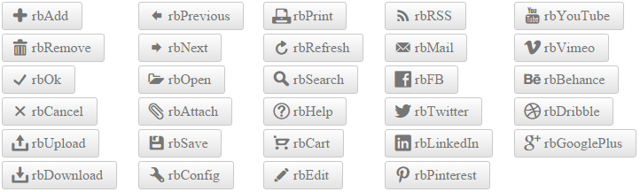
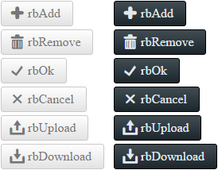

# Icons Overview

This help article shows how to use embedded icons in **RadPushButton**, lists the necessary CSS classes and describes the skins specifics.

* [Configuration](#configuration)

* [CssClass List of Embedded Icons](#cssclass-list-of-embedded-icons)

* [Skins Specifics](#skins-specifics)

>caption Figure 1: List of Embedded icons in RadPushButton.



You can also use [custom icons]() (image or font icons) and [fine-tune their position, color and size]().

## Configuration

To make the control easier to use, **Telerik** provides a large set of built-in icons (**Figure 1**). To use them, set the **Icon.CssClass** property (**Example 1**) to one of the predefined [CSS class names](#cssclass-list-of-embedded-icons), and the respective icon will be shown on the control.

>caption Figure 2: RadPushButton with an embedded icon (Icon.CssClass="rbOk") from Example 1.


>caption Example 1: Declaration of embedded icon in RadPushButton.

````ASP.NET
<telerik:RadPushButton ID="RadPushButton1" runat="server" Text="Button with Icon">
	<Icon CssClass="rbOk" />
</telerik:RadPushButton>
````

## CssClass List of Embedded Icons

You can find below the full list of CSS classes responsible for the embedded icons in **RadPushButton**. The **CssClass** is composed in the following way: [**r**]ad[**b**]utton[**IconName**]. For example **rbAdd**.

* rbAdd
* rbRemove
* rbOk
* rbCancel
* rbUpload
* rbDownload
* rbPrevious
* rbNext
* rbOpen
* rbAttach
* rbSave
* rbConfig
* rbPrint
* rbRefresh
* rbSearch
* rbHelp
* rbCart
* rbEdit
* rbRSS
* rbMail
* rbFB
* rbTwitter

## Skins Specifics

The color of the predefined icons can be white or black, depending on the chosen Skin. You can see the difference for the **Silk** and **Glow** skin in **Figure 3**.

>caption Figure 3: Embedded icons in RadPushButton for the Silk and Glow skin have white and black colors.



<!-- The code that creates Figure 3 is available in examples/DefaultCS.aspx page
-->


## See Also

 * [Fine-tune Icons]()
 
 * [Custom Icons]()

 * [PushButton - Embedded Icons Demo](http://demos.telerik.com/aspnet-ajax/pushbutton/functionality/embedded-icons/defaultcs.aspx)
 
 * [PushButton - Custom Icons Demo](http://demos.telerik.com/aspnet-ajax/pushbutton/functionality/custom-icons/defaultcs.aspx)
 


 