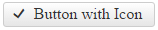
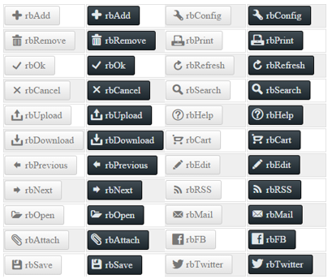
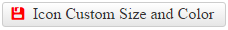

# Icons Overview

This help article shows how to use icons in **RadPushButton**. You can use the built-in font icons or your own images for its different states (COMMENT: Clarify/expand. It is not clear what those states are) and even fine tune their position.

(COMMENT: Add another paragraph that explains there are embedded icons, custom icons and that you can tweak them both).

(COMMENT: This article is still too long, split it further. Perhaps only the first section should remain as it is, and fine-tuning and changing font/color should be in a separate article about icon customization/fine-tuning. Also, you should add that top and left work for custom raster icons as well).

* [Use Embedded Icons](#use-embedded-icons)

* [Fine-tune Icon Position](#fine-tune-icon-position)

* [Configure Icon Font-size and Color](#configure-icon-font-size-and-color)

## Use Embedded Icons

To make the control easier to use, **Telerik** provides a large set of built-in icons (**Figure 2**). To use them, set the **Icon.CssClass** property (**Example 1**) to one of the predefined CSS class names (**List 1**), and the respective icon will be shown on the control.

>caption Figure 1: RadPushButton with an embedded icon (Icon.CssClass="rbOk") from Example 1.



>caption Example 1: Declaration of embedded icon in RadPushButton.

````ASP.NET
<telerik:RadPushButton ID="RadPushButton1" runat="server" Text="Button with Icon">
	<Icon CssClass="rbOk" />
</telerik:RadPushButton>
````

>caption List 1: CSS classes of embedded icons in **RadPushButton**.

* rbAdd
* rbRemove
* rbOk
* rbCancel
* rbUpload
* rbDownload
* rbPrevious
* rbNext
* rbOpen
* rbAttach
* rbSave
* rbConfig
* rbPrint
* rbRefresh
* rbSearch
* rbHelp
* rbCart
* rbEdit
* rbRSS
* rbMail
* rbFB
* rbTwitter

The color of the predefined icons can be white or black, depending on the chosen Skin. You can make the difference for the **Silk** and **Glow** skin in **Figure 2**.

>caption Figure 2: Embedded icons in RadPushButton for the Silk and Glow skin have white and black colors.



>note The **CssClass** is composed in the following way: [**r**]ad[**b**]utton[**IconName**]. For example **rbAdd**.

<!-- (COMMENT: Put that in a separate file (e.g., archive) in the folder instead of bloating the article content)
The code that creates Figure 3
ASPX:
<style type="text/css">
	/*Format tables*/
	tr:first-child {
		font-weight: bold;
	}

	tr:nth-child(odd) {
		background: #efefef;
	}

	td {
		border: 1px solid #ddd;
	}

	table {
		display: inline;
		float: left;
	}
</style>

<telerik:RadScriptManager ID="RadScriptManager1" runat="server"></telerik:RadScriptManager>

<table id="table1" runat="server">
	<tr>
		<td>Class Name</td>
		<td>Silk
		</td>
		<td>Glow</td>
	</tr>
</table>

C#:
protected void Page_Init(object sender, EventArgs e)
{
	string[] embeddedIcons = new string[] { "rbAdd", "rbRemove", "rbOk", "rbCancel", "rbUpload", "rbDownload", "rbPrevious", "rbNext", "rbOpen", "rbAttach",
"rbSave", "rbConfig", "rbPrint", "rbRefresh", "rbSearch", "rbHelp", "rbCart", "rbEdit", "rbRSS", "rbMail", "rbFB", "rbTwitter"};

	for (int i = 0; i < embeddedIcons.Length; i++)
	{
		string currIcon = embeddedIcons[i];

		ConfigureTableIcons(currIcon, i.ToString());
	}
}

protected void ConfigureTableIcons(string icon, string index)
{
	//Add class name for 16px icons:
	HtmlTableRow row1 = new HtmlTableRow();
	AddRowIconClassName(icon, table1, row1);

	//Add RadPushButton with icons, Default skin:
	AddRadPushButtonWithIcon("0" + index, icon, "Silk", null, null, table1, row1);

	//Add RadPushButton with icons, Glow skin:
	AddRadPushButtonWithIcon("0" + index, icon, "Glow", null, null, table1, row1);

}

protected void AddRowIconClassName(string icon, HtmlTable table, HtmlTableRow row)
{
	HtmlTableCell cell1 = new HtmlTableCell();
	cell1.InnerHtml = icon;
	row.Cells.Add(cell1);
	table.Rows.Add(row);
}

protected void AddRadPushButtonWithIcon(string ID, string IconName, string Skin, int? Height, int? Top, HtmlTable table, HtmlTableRow row)
{
	HtmlTableCell cell = new HtmlTableCell();
	RadPushButton RadPushButton1 = new RadPushButton()
	{
		ID = "RadPushButton1" + ID,
		Text = IconName,
		Skin = Skin,
	};
	if (Height != null)
		RadPushButton1.Height = Unit.Pixel((int)Height);

	RadPushButton1.Icon.CssClass = IconName;
	if (Top != null)
		RadPushButton1.Icon.Top = Unit.Pixel((int)Top);

	cell.Controls.Add(RadPushButton1);
	row.Cells.Add(cell);
	table.Rows.Add(row);
}

-->

## Fine-tune Icon Position

You can change the icon position to match your concrete requirements. To do this, use the `Icon.Top` and `Icon.Left` properties to directly offset the icon (**Example 2**).

>caption Figure 3: The icon in RadPushButton can be offset from its original top and left position. See Example 2.


>caption Example 2: Offset RadPushButton Icon from the top and left. You can see the result in Figure 3.

````ASP.NET
<telerik:RadPushButton ID="RadPushButton1" runat="server" Text="Fine Tune Icon Position" Height="40px">
	<Icon CssClass="rbRefresh"
		Top="12px" Left="7px" />
</telerik:RadPushButton>
````

## Configure Icon Font-size and Color

The embedded **RadPushButton** icons are font icons (**Figure 2**)(COMMENT: What does Figure 2 show in relevance to the font icons? Clarify). Using a font facilitates the customization of the icons. For example, you can change the icons color and font size with a single line of CSS (see **Figure 4** and **Example 3**).

>caption Figure 4: Customize the font size and color of the embedded icons of RadPushButton with CSS.



>caption Example 3: Use CSS to modify the font size and color of the embedded icons in RadPushButton.

````CSS
<style type="text/css">
	button.RadButton.customizeIcon .rbPrimaryIcon:before {
		color: red;
		font-size: 17px;
	}
</style>
````

````ASP.NET
<telerik:RadPushButton ID="RadPushButton1" runat="server" Text="Icon Custom Size and Color" CssClass="customizeIcon">
	<Icon CssClass="rbSave" />
</telerik:RadPushButton>
````

## See Also

 * [Custom Icons]()

 * [PushButton - Embedded Icons Demo](http://demos.telerik.com/aspnet-ajax/pushbutton/functionality/embedded-icons/defaultcs.aspx)
 
 * [PushButton - Custom Icons Demo](http://demos.telerik.com/aspnet-ajax/pushbutton/functionality/custom-icons/defaultcs.aspx)
 


 