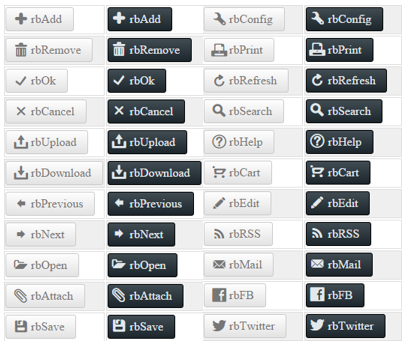

# Icons Overview

This help article shows how to use icons in **RadPushButton**. You can use the built-in font icons or your own images for its different states and even fine tune their position.

1. [Configure Button With an Icon](#configure-button-with-an-icon)

1. [Fine-tune Icon Position](#fine-tune-icon-position)

1. [Use Embedded Icons](#use-embedded-icons)

## Configure Button With an Icon

You can make your button more intuitive by showing an icon on the left-hand side of the control (**Example 1** and **Figure 1**). All the Icon-related properties are controlled through the **RadPushButton.Icon** inner property. To display an icon on the button, you need to set either the **Icon.Url** property, or the **Icon.CssClass** property.

>caption Figure 1: RadPushButton controls configured with an icon from Example 1.


>caption Example 1: Configure a **RadPushButton** with an icon through the **Icon.Url** and **Icon.CssClass** properties.

````CSS
<style type="text/css">
	body {
		font-size: 14px;
	}

	.classNextArrow {
		background-image: url('http://demos.telerik.com/aspnet-ajax/button/examples/embeddedicons/images/rbPredefinedIcons.png');
		background-position: -168px 0;
	}
</style>
````

````ASP.NET
<telerik:RadPushButton ID="RadPushButton1" runat="server" Text="Button With Icon">
	<Icon CssClass="classNextArrow" />
</telerik:RadPushButton>

<telerik:RadPushButton ID="RadPushButton2" runat="server" Text="Button With Icon">
	<Icon Url="http://demos.telerik.com/aspnet-ajax/button/examples/embeddedicons/images/rbPredefinedIcons.png" />
</telerik:RadPushButton>
````

**RadPushButton** provides an easy way to show different icon when the mouse is over the control, or the button is pressed (**Figure 2** and **Example 2**). This is achieved through the **HoveredCssClass** and **PressedCssClass** properties exposed by the **Icon** tag.

>caption Figure 2: A RadPushButton can have different icons for its normal, hovered and active state.


**Example 2:** Setup unique icons for the normal, hovered and active state of a **RadPushButton**.

````ASP.NET
<telerik:RadPushButton ID="RadPushButton1" runat="server" Text="Normal Hover Active State Icons">
	<Icon Url="http://demos.telerik.com/aspnet-ajax/button/examples/customicons/images/ePlayer.png"
		HoveredUrl="http://demos.telerik.com/aspnet-ajax/button/examples/customicons/images/eFlash.png"
		PressedUrl="http://demos.telerik.com/aspnet-ajax/button/examples/customicons/images/eTime.png" />
</telerik:RadPushButton>
````

## Fine-tune Icon Position

At first the Icons might not be positioned exactly the way we want, but this can be easily changed by directly setting the properties that control the top and left offset of the icon - **Icon.Top** and **Icon.Left**

````ASP.NET
<telerik:RadPushButton ID="RadPushButton2" runat="server" Text="Spell Check Html">
	<Icon Url="http://demos.telerik.com/aspnet-ajax/button/examples/customicons/images/eSpellCheck.png"
		Top="4px" Left="7px" />
</telerik:RadPushButton>
````

Alternatively, a CSS class can be set to the icon, and the position configured using CSS.

````CSS
<style type="text/css">
	.classSpellCheck {
		top: 4px;
		left: 7px;
	}
</style>
````

````ASP.NET
<telerik:RadPushButton ID="RadPushButton3" runat="server" Text="Spell Check Html">
	<Icon Url="http://demos.telerik.com/aspnet-ajax/button/examples/customicons/images/eSpellCheck.png" CssClass="classSpellCheck" />
</telerik:RadPushButton>
````


## Use Embedded Icons

To make the control even easier to use **Telerik** provides a large set of built-in icons (**Figure 3**). To use them, set the **Icon.CssClass** property to one of the predefined CSS class names, and the respective icon will be shown on the control. The full list of the CSS classes can be found in **List 1**.

>caption List 1: CSS classes of embedded icons in **RadPushButton** shown in **Figure 3**.

* rbAdd
* rbRemove
* rbOk
* rbCancel
* rbUpload
* rbDownload
* rbPrevious
* rbNext
* rbOpen
* rbAttach
* rbSave
* rbConfig
* rbPrint
* rbRefresh
* rbSearch
* rbHelp
* rbCart
* rbEdit
* rbRSS
* rbMail
* rbFB
* rbTwitter

>caption Figure 3: List of embedded icons in RadPushButton for Silk and Glow skins.



>note The **CssClass** is composed in the following way: [**r**]ad[**b**]utton[**IconName**]. For example **rbAdd**.

<!--
The code that creates Figure 3
ASPX:
<style type="text/css">
	/*Format tables*/
	tr:first-child {
		font-weight: bold;
	}

	tr:nth-child(odd) {
		background: #efefef;
	}

	td {
		border: 1px solid #ddd;
	}

	table {
		display: inline;
		float: left;
	}
</style>

<telerik:RadScriptManager ID="RadScriptManager1" runat="server"></telerik:RadScriptManager>

<table id="table1" runat="server">
	<tr>
		<td>Class Name</td>
		<td>Silk
		</td>
		<td>Glow</td>
	</tr>
</table>

C#:
protected void Page_Init(object sender, EventArgs e)
{
	string[] embeddedIcons = new string[] { "rbAdd", "rbRemove", "rbOk", "rbCancel", "rbUpload", "rbDownload", "rbPrevious", "rbNext", "rbOpen", "rbAttach",
"rbSave", "rbConfig", "rbPrint", "rbRefresh", "rbSearch", "rbHelp", "rbCart", "rbEdit", "rbRSS", "rbMail", "rbFB", "rbTwitter"};

	for (int i = 0; i < embeddedIcons.Length; i++)
	{
		string currIcon = embeddedIcons[i];

		ConfigureTableIcons(currIcon, i.ToString());
	}
}

protected void ConfigureTableIcons(string icon, string index)
{
	//Add class name for 16px icons:
	HtmlTableRow row1 = new HtmlTableRow();
	AddRowIconClassName(icon, table1, row1);

	//Add RadPushButton with icons, Default skin:
	AddRadPushButtonWithIcon("0" + index, icon, "Silk", null, null, table1, row1);

	//Add RadPushButton with icons, Glow skin:
	AddRadPushButtonWithIcon("0" + index, icon, "Glow", null, null, table1, row1);

}

protected void AddRowIconClassName(string icon, HtmlTable table, HtmlTableRow row)
{
	HtmlTableCell cell1 = new HtmlTableCell();
	cell1.InnerHtml = icon;
	row.Cells.Add(cell1);
	table.Rows.Add(row);
}

protected void AddRadPushButtonWithIcon(string ID, string IconName, string Skin, int? Height, int? Top, HtmlTable table, HtmlTableRow row)
{
	HtmlTableCell cell = new HtmlTableCell();
	RadPushButton RadPushButton1 = new RadPushButton()
	{
		ID = "RadPushButton1" + ID,
		Text = IconName,
		Skin = Skin,
	};
	if (Height != null)
		RadPushButton1.Height = Unit.Pixel((int)Height);

	RadPushButton1.Icon.CssClass = IconName;
	if (Top != null)
		RadPushButton1.Icon.Top = Unit.Pixel((int)Top);

	cell.Controls.Add(RadPushButton1);
	row.Cells.Add(cell);
	table.Rows.Add(row);
}

-->

The embedded icons of **RadPushButton** are font icons (**Figure 4**). Using a font facilitates the customization of the icons. For example, you can change the icons color and font size with a single line of CSS (**Figure 5** and **Example 4**).

>caption Figure 4: Embedded icons of RadPushButton for Default and Black skin.


>caption Example 3: Declaration of two RadPushButton controls with icons for Default and Black skin.

````ASP.NET
<telerik:RadPushButton ID="RadPushButton1" runat="server" Text="Default Skin" Skin="Default">
	<Icon CssClass="rbOk" />
</telerik:RadPushButton>

<telerik:RadPushButton ID="RadPushButton2" runat="server" Text="Black Skin" Skin="Black">
	<Icon CssClass="rbOk" />
</telerik:RadPushButton>
````

>caption Figure 5: You can easily customize the font size and color of the embedded icons of RadPushButton with CSS.


>caption Example 4: Use only CSS to modify the font size and color of embedded icons in RadPushButton.

````CSS
<style type="text/css">
	button.RadButton.customizeIcon .rbPrimaryIcon {
		color: red;
		font-size: 17px;
	}
</style>
````

````ASP.NET
<telerik:RadPushButton ID="RadPushButton1" runat="server" Text="Icon Custom Size and Color" CssClass="customizeIcon">
	<Icon CssClass="rbSave" />
</telerik:RadPushButton>
````

## See Also

 * [Button - Embedded Icons Online Demo](http://demos.telerik.com/aspnet-ajax/pushbutton/examples/embeddedicons/defaultcs.aspx)

 