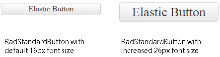

# Elastic Design

This article explains the **elastic design capabilities RadPushButton offers**. The **Example 1** below shows the basic approaches you can use to scale the control by only changing its default font size.

@[template](/_templates/common/render-mode.md#resp-design-desc "slug-el: no, slug-fl: pushbutton/mobile-support/fluid-design")

>caption Figure 1: Comparison between appearance of a RadPushButton with regular font size and with increased font size.



@[template](/_templates/common/font-size-notes.md#note-and-example "control: RadPushButton")

>caption Example 2: Shows how to increase the font size of a RadPushButton in Figure 1.

````CSS
<style type="text/css">
	button.RadButton {
		font-size: 26px;
	}
</style>
````

````ASP.NET
<telerik:RadPushButton runat="server" ID="StandartButton"
	Text="Elastic Button" Skin="Default" Width="200px">
</telerik:RadPushButton>
````

## See Also

 * [Mobile Support Overview]()

 * [Render Modes]()

 * [Fluid Design]()

@[template](/_templates/common/font-size-notes.md#related-resources)
