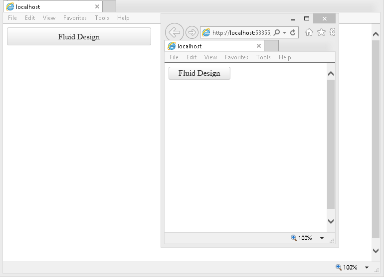

# Fluid Design

This article explains the **fluid design capabilities RadPushButton offers**. The **Example 1** below shows how you can set button size in percent so it can resize with its parent element.

Generally, responsive design means that the page and its content are able to adapt to different screen resolutions without deteriorating the user experience. This often includes [changing the font size]() and having dimensions set in percent.

>caption Figure 1: RadPushButton set to 100% width and and 25% height.



>caption Example 1: Shows the markup that provides fluid design of the RadPushButton in Figure 1.

````ASP.NET
<style>
	html, body, form {
		height:100%;
	}
</style>

<div style="width:40%; height:30%;">
	<telerik:RadPushButton runat="server" ID="StandartButton" 
		Text="Fluid Design" Skin="Default" Width="100%" Height="25%">
	</telerik:RadPushButton>
</div>
````

## See Also

 * [Mobile Support Overview]()

 * [Render Modes]()

 * [Elastic Design]()

