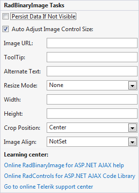

# RadBinaryImage


__RadBinaryImage__ gives you an easy way of showing an image stored as binary data in a database. The control can be used in any data bound control (__Repeater__, __DataList__, __GridView__, etc.) to display images which originate from binary image field in the data source. The control uses an internal http handler which streams the image from the binary source to the page in which it has to be visualized.The storage of the binary stream when transferred between the control itself and the handler is the *HttpContext.Current.Cache* object and the image is cached in the browser. Its default expiration time is 2 hours (unless the control in which the __RadBinaryImage__is nested is rebound or recreated). This means that subsequent loads of the binary image are taken from the browser cache when using the same url for access. In case the browser cache is disabled, the image will be persisted for 2 minutes on the server before it is streamed to the page from the data source.

## 

The most important properties of the __RadBinaryImage__ control are presented in the table from the next paragraph:


>caption  

| Property | Description |
| ------ | ------ |
| __DataValue__ |Property which specifies the source field from which the data will be passed as a byte array|
| __Height__ |Specifies the height of the binary image|
| __Width__ |Specifies the width of the binary image|
| __AlternateText__ |The text that will replace the image when it is not available/cannot be streamed|
| __ToolTip__ |The text that will be displayed in a browser tooltip when you hover the image|
| __AutoAdjustImageControlSize__ |Scales the image based on explicitly set width __/__ height dimensions to avoid stretch or blur effect when its original dimensions do not fit. The default value is true.|
| __CropPosition__ |Used when the __ResizeMode__ is set to __Crop__ . Specifies the cropping position, i.e. which part of the image will be cropped. The possible values are: __Top, Center, Bottom, Left, Right__ .|
| __HttpHandlerUrl__ |Can be used to specify the location of a custom http handler which extends the default __RadBinaryImage__ http handler. When not set, __RadBinaryImage__ has its own handler which is invoked through the common __Telerik.WebResource.axd__ handler.|
| __ImageUrl__ |Applicable when no __DataValue__ is specified to gracefully degrade to regular __ASP.NET__  __Image__ mode. When null value is returned from the source, the __ImageUrl__ property can be used to specify default image for __RadBinaryImage__ |
| __ImageAlign__ |Specifies the image alignment inside its container.|
| __ImageStorageLocation__ |Gets or sets a value indicating where the binary image will be stored.|
| __ResizeMode__ |Specifies whether the image should be sized automatically if width and height of the image are set in pixels. Possible values are:

*  __Crop__ (the image will be trimmed)

*  __Fill__ (the image will be sized to fill both given dimensions)

*  __Fit__ (the image will be sized to fit the given dimensions)

*  __None__ (default)|
| __SavedImageName__ |Sets image’s filename which will appear inside SaveAs browser dialog if image is saved|
| __PersistDataIfNotVisible__ |If set to true image data persistence is forced if the control is invisible.|
| __VisibleWithoutSource__ |Specifies whether the image will be rendered if a valid source is not present. The default value is __True__ .|

## RadBinaryImage Design Time

The RadBinaryImage Smart Tag provides convenient access to the most common used properties for the control.	You can display the Smart Tag by right clicking on the RadBinaryImage in the design window, and choosing the "Show Smart Tag"	option from its context menu.

>note When you want to display transparent .gif images using a RadBinaryImage, you should set its __ResizeMode__ property to __None__ . This is so because image transformations with such files are not supported.
>


Here is an [online demo](http://demos.telerik.com/aspnet-ajax/binaryimage/examples/overview/defaultcs.aspx) which demonstrates how to integrate __RadBinaryImage__ as part of __ASP.NET____Repeater__ template. The screen shot from the result is available below:


````ASPNET
	<html xmlns="http://www.w3.org/1999/xhtml">
	<head id="Head1" runat="server">
	    <title></title>
	    <link href="stylesheet.css" rel="stylesheet" type="text/css" />
	</head>
	<body class="BODY">
	    <form id="form1" runat="server">
	    <div>
	        <telerik:RadScriptManager ID="RadScriptManager1" runat="server" />
	        <asp:Repeater runat="server" ID="Repeater1" DataSourceID="SqlDataSource2">
	            <ItemTemplate>
	                <fieldset style="float: left; width: 350px; height: 150px;">
	                    <legend><b>Company Name</b>:
	                        <%#Eval("CompanyName")%></legend>
	                    <div class="details">
	                        <div class="photo-container">
	                            <telerik:RadBinaryImage runat="server" ID="RadBinaryImage1" DataValue='<%#Eval("Photo") %>'
	                                AutoAdjustImageControlSize="false" Width="90px" Height="110px" ToolTip='<%#Eval("ContactName", "Photo of {0}") %>'
	                                AlternateText='<%#Eval("ContactName", "Photo of {0}") %>' />
	                        </div>
	                        <div class="data-container">
	                            <ul>
	                                <li>
	                                    <label>
	                                        Contact Name:</label>
	                                    <%#Eval("ContactName")%>
	                                </li>
	                                <li>
	                                    <label>
	                                        Title:</label>
	                                    <%#Eval("ContactTitle")%>
	                                </li>
	                                <li>
	                                    <label>
	                                        City:</label>
	                                    <%#Eval("City")%>
	                                </li>
	                                <li>
	                                    <label>
	                                        Country:</label>
	                                    <%#Eval("Country")%>
	                                </li>
	                                <li>
	                                    <label>
	                                        Phone:</label>
	                                    <%#Eval("Phone")%>
	                                </li>
	                            </ul>
	                        </div>
	                    </div>
	                </fieldset>
	            </ItemTemplate>
	        </asp:Repeater>
	        <div style="clear: both;">
	        </div>
	        <telerik:RadFormDecorator runat="server" ID="radFormDecorator" DecoratedControls="All" />
	        <asp:SqlDataSource ID="SqlDataSource2" runat="server" ConnectionString="<$ ConnectionStrings>"
	            ProviderName="<$ ConnectionStrings>" SelectCommand="SELECT TOP 6 * FROM [CustomerPhotos]">
	        </asp:SqlDataSource>
	    </div>
	    </form>
	</body>
	</html>
````


>note You need to register the http handler of the __RadBinaryImage__ control either using its __Smart__  __Tag__ or manually in the __web.config__ file to ensure that it will be served as expected when the page is rendered. Namely:
>


````XML
	<httpHandlers>
		<remove path="*.asmx" verb="*" />
		...
		<add path="Telerik.Web.UI.WebResource.axd" type="Telerik.Web.UI.WebResource" verb="*" validate="false" />
	</httpHandlers>
````


````XML
	<system.webServer>
	    ...
	    <handlers>
	        <add name="Telerik_Web_UI_WebResource_axd" verb="*" preCondition="integratedMode" path="Telerik.Web.UI.WebResource.axd" type="Telerik.Web.UI.WebResource" />
	    </handlers>
	</system.webServer>
````


## WAI-ARIA Support

The __RadBinaryImage__ control offers __WAI-ARIA__ support which can be easily enabled by setting the __EnableAriaSupport__ server property to __true__.

RadBinaryImage ARIA attributes are __lower case__. They are shown in the table below:


>caption  

|  __Control__  |  __Attributes__  |
| ------ | ------ |
| __RadBinaryImage__ |Role: imgAria-labelAria-atomic|

>note An issue with the use of WAI-ARIA in HTML documents is that they don’t validate. When you run a HTML document containing ARIA attributes through the W3C Validator it shows errors in the results for any ARIA attributes. The DOCTYPE declarations do not include any information about the WAI ARIA attributes and you cannot have a valid document which includes elements, attributes, and attribute values, not detailed in its DTD’s.
>


## Using RadBinaryImage in a WebFarm/WebGarden Environment

By default the __RadBinaryImage__ control stores the BinaryImage in the Cache object. In case your applicationis configured to run in any of the environments, listed below, there will be a problem accessing the binary image:

* __Web Farm__ - The application runs on more than one web server at the same time.

* __Web Garden__ - The application runs on a single server, but the server load is divided among many worker processes (more than one process are running the same application).

Usually, every server (or every worker process) has an independent Cache, which means that, when the page request is not handled by the sameweb server (worker process), the BinaryImage will be null and a gray image will be shown.

To avoid this behavior, you should store the binary image in the Session and configure your server environment to use out of process Session State(i.e. the Session object is shared among different processes and servers). The last is achievable by following the steps listed below:

1. Set the __RadBinaryImage.ImageStorageLocation__ property to __Session__.

1. Setup a __sessionState__ as described in [this](http://dotnetcodr.com/2013/07/01/web-farms-in-net-and-iis-part-5-session-state-management/) blog post.

1. Configure the httpHandler in the following way:

````XML
	<configuration>
		<system.web>
			<httpHandlers>
				<add path="Telerik.Web.UI.WebResource.axd" type="Telerik.Web.UI.WebResourceSession, Telerik.Web.UI" verb="*" validate="false" />
			</httpHandlers>
		</system.web>
		<system.webServer>
			<handlers>
				<add name="Telerik_Web_UI_WebResource_axd" verb="*" preCondition="integratedMode" path="Telerik.Web.UI.WebResource.axd" type="Telerik.Web.UI.WebResourceSession, Telerik.Web.UI" />
			</handlers>
		</system.webServer>
	</configuration>
````


# See Also

 * [Integrating RadControls for ASP.NET AJAX in a WebFarm or WebGarden scenario](http://blogs.telerik.com/aspnet-ajax/posts/13-03-01/integrate-radcontrols-for-asp.net-ajax-in-a-webfarm-or-webgarden)
