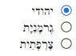

# Right-to-Left Support

The **RadRadioButtonList** fully supports right-to-left (RTL) language locales (**Figure 1**). In order to turn on the RTL support, you should set **dir=rtl to the html or body** element or at least to its parent element (**Figure 1**). You can also use the **direction:rtl** CSS property.

>caption Figure 1: RadRadioButtonList in RTL mode.



>caption Example 1: Set the "direction: rtl" style to the **RadRadioButtonList**'s wrapper element in order to enable the RTL support for the control.

````ASP.NET
<div style="direction: rtl">
    <telerik:RadRadioButtonList runat="server" ID="RadRadioButtonList1">
        <Items>
            <telerik:RadioButtonListItem Text="יהודי" Selected="true" />
            <telerik:RadioButtonListItem Text="גֶרמָנִיָת" />
            <telerik:RadioButtonListItem Text="צָרְפָתִית" />
        </Items>
    </telerik:RadRadioButtonList>
</div>
````

## See Also

 * [WCAG 2.0 and Section 508 Accessibility Compliance]()

 * [Keyboard Support]()
