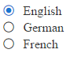

# RadRadioButtonList Overview

The **RadRadioButtonList** control (**Figure 1**) enriches the features of the ASP.NET RadioButtonList control. Additionally, it provides events, supports Commands and numerous [themes](). **RadRadioButtonList** is available as of **R3 2016**.

You can easily style the control by changing the `Skin` property. This will eliminate the need to use the [RadFormDecorator](). Developers can easily migrate their applications from using the standard ASP.NET (RadioButtonList) controls to the **RadRadioButtonList** control, because most of the RadioButtonList's functionality is provided by the **RadRadioButtonList** control, and the **RadRadioButtonList** is controlled by the same or similar (intuitive) properties.


>caption Figure 1: RadRadioButtonList configuration.



>caption Example 1: A basic example of a RadRadioButtonList setup.

````ASP.NET
<telerik:RadRadioButtonList runat="server" ID="RadRadioButtonList1">
    <Items>
        <telerik:ButtonListItem Text="English" Selected="true" />
        <telerik:ButtonListItem Text="German" />
        <telerik:ButtonListItem Text="French" />
    </Items>
</telerik:RadRadioButtonList>
````

>tip **RadRadioButtonList** does not support Classic [render mode](). Setting its RenderMode to Classic will default to the Lightweight render mode.

## See Also

 * [RadRadioButtonList Online Demos](http://demos.telerik.com/aspnet-ajax/radiobuttonlist/examples/overview/defaultcs.aspx)
 
 * [RadRadioButtonList Getting Started]()
 
 * [RadRadioButtonList Properties and Events]()
 
