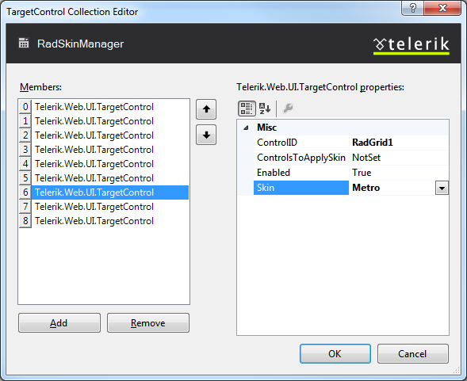

# RadSkinManager

This article provides the following information:


* [What is RadSkinManager](#what-is-radskinmanager)

* [How to use RadSkinManager](#how-to-use-radskinmanager)

* [Server-side specifics](#server-side-specifics)

* [Using RadSkinManager for applying custom skins](#using-radskinmanager-for-applying-custom-skins)

   * [Register custom skins by specifying a path](#loading-skins-by-specifying-a-path)

   * [Register custom skins from an external assembly](#loading-skins-from-an-external-assembly)
   
   




## What is RadSkinManager?

There are various methods to specify the skins for Telerik controls - declaratively or programmatically as a part of the control definition, on page or application level using the ASP.NET Theme mechanism or globally for all pages in the application using the web.config file. However, there are situations in which these methods may not be very convenient when having large number of Telerik controls, especially when you want to define global style settings for some of them and yet have specific skin applied for a subset of them.

This is where the RadSkinManager control comes into place. Its intuitive design-time options allow you to define global skin for the Telerik controls on the page as well as granular settings for particular controls through the TargetControls collection. Below are a couple of screen shots which visualize that.




## How to use RadSkinManager?

By default the **Skin** property of RadSkinManager is an empty string. If the property is set to a different value and Enabled is set to true for the control, the manager will apply automatically the specified skin to all Telerik controls on the form.

If you set the **ShowChooser** property to true the manager will display run-time RadComboBox as a part of its smart tag, populated with all embedded skins, where you can pick a skin. Additionally, in the TargetControls (persisted in ViewState) collection you can add per-control skin setting (setting **TargetControl -> ID** and **TargetControl -> Skin**) alongside with **Enabled** property value to enable/disable this particular setting.You can select any Telerik control on the form and the manager will find recursively all ISkinableControl instances to set their skin.

Here is a sample RadSkinManager definition which will apply **Web20** skin for all Telerik controls which does not have **Skin** set explicitly via their individual property or are not included as skinned controls through the **TargetControls** collection. For the rest of the components either the skin defined through their **Skin** property or via the respective **TargetControls** definition will be propagated:

````ASPNET
<asp:ScriptManager ID="ScriptManager1" runat="server" />
<div>
    <telerik:RadSkinManager ID="RadSkinManager1" runat="server" ShowChooser="false" Skin="Web20">
        <TargetControls>
            <telerik:TargetControl ControlID="RadComboBox1" Skin="Vista" />
            <telerik:TargetControl ControlID="RadEditor1" Skin="Vista" />
            <telerik:TargetControl ControlID="RadDatePicker1" Skin="WebBlue" />
            <telerik:TargetControl ControlID="RadNumericTextBox1" Skin="Outlook" />
            <telerik:TargetControl ControlID="RadTreeView1" Skin="WebBlue" />
            <telerik:TargetControl ControlID="RadMenu1" Skin="Outlook" />
            <telerik:TargetControl ControlID="RadTabStrip1" Skin="Sunset" />
            <telerik:TargetControl ControlID="RadPanelBar1" Skin="Hay" />
        </TargetControls>
    </telerik:RadSkinManager>
</div>
<telerik:RadComboBox RenderMode="Lightweight" ID="RadComboBox1" runat="server">
    <Items>
        <telerik:RadComboBoxItem runat="server" Text="RadComboBoxItem1" Value="RadComboBoxItem1" />
        <telerik:RadComboBoxItem runat="server" Text="RadComboBoxItem2" Value="RadComboBoxItem2" />
        <telerik:RadComboBoxItem runat="server" Text="RadComboBoxItem3" Value="RadComboBoxItem3" />
    </Items>
    <CollapseAnimation Type="OutQuint" Duration="200"></CollapseAnimation>
</telerik:RadComboBox>
<telerik:RadGrid RenderMode="Lightweight" ID="RadGrid1" runat="server" DataSourceID="SqlDataSource1" AllowSorting="True"
    Skin="Office2007" ShowStatusBar="true" GridLines="None" Width="95%">
    <MasterTableView Width="100%" AllowMultiColumnSorting="true" />
    <SortingSettings SortedBackColor="Azure" />
</telerik:RadGrid>
<br />
<asp:SqlDataSource ID="SqlDataSource1" ConnectionString="<%$ ConnectionStrings:NorthwindConnectionString %>"
    ProviderName="System.Data.SqlClient" SelectCommand="SELECT TOP 10 CustomerID, CompanyName, ContactName, ContactTitle, Address, PostalCode FROM Customers"
    runat="server"></asp:SqlDataSource>
<telerik:RadEditor RenderMode="Lightweight" ID="RadEditor1" runat="server" />
<telerik:RadCalendar RenderMode="Lightweight" ID="RadCalendar1" runat="server">
</telerik:RadCalendar>
<telerik:RadDatePicker RenderMode="Lightweight" ID="RadDatePicker1" runat="server">
</telerik:RadDatePicker>
<telerik:RadNumericTextBox RenderMode="Lightweight" ID="RadNumericTextBox1" runat="server">
</telerik:RadNumericTextBox>
<telerik:RadTreeView RenderMode="Lightweight" ID="RadTreeView1" runat="server">
    <Nodes>
        <telerik:RadTreeNode runat="server" Text="Root RadTreeNode1">
            <Nodes>
                <telerik:RadTreeNode runat="server" Text="Child RadTreeNode 1">
                    <Nodes>
                        <telerik:RadTreeNode runat="server" Text="Child RadTreeNode 1">
                        </telerik:RadTreeNode>
                        <telerik:RadTreeNode runat="server" Text="Child RadTreeNode 2">
                        </telerik:RadTreeNode>
                    </Nodes>
                </telerik:RadTreeNode>
            </Nodes>
        </telerik:RadTreeNode>
        <telerik:RadTreeNode runat="server" Text="Root RadTreeNode2">
            <Nodes>
                <telerik:RadTreeNode runat="server" Text="Child RadTreeNode 1">
                </telerik:RadTreeNode>
            </Nodes>
        </telerik:RadTreeNode>
    </Nodes>
    <CollapseAnimation Type="OutQuint" Duration="100"></CollapseAnimation>
    <ExpandAnimation Duration="100"></ExpandAnimation>
</telerik:RadTreeView>
<telerik:RadMenu RenderMode="Lightweight" ID="RadMenu1" runat="server">
    <CollapseAnimation Type="OutQuint" Duration="200"></CollapseAnimation>
    <Items>
        <telerik:RadMenuItem runat="server" Text="Root RadMenuItem1">
        </telerik:RadMenuItem>
        <telerik:RadMenuItem runat="server" Text="Root RadMenuItem2">
        </telerik:RadMenuItem>
        <telerik:RadMenuItem runat="server" Text="Root RadMenuItem3">
        </telerik:RadMenuItem>
    </Items>
</telerik:RadMenu>
<telerik:RadTabStrip RenderMode="Lightweight" ID="RadTabStrip1" runat="server">
    <Tabs>
        <telerik:RadTab runat="server" Text="Root RadTab1">
        </telerik:RadTab>
        <telerik:RadTab runat="server" Text="Root RadTab2">
        </telerik:RadTab>
        <telerik:RadTab runat="server" Text="Root RadTab3">
        </telerik:RadTab>
    </Tabs>
</telerik:RadTabStrip>
<telerik:RadPanelBar RenderMode="Lightweight" ID="RadPanelBar1" runat="server">
    <CollapseAnimation Type="None" Duration="100"></CollapseAnimation>
    <Items>
        <telerik:RadPanelItem runat="server" Text="Root RadPanelItem1">
            <Items>
                <telerik:RadPanelItem runat="server" Text="Child RadPanelItem 1">
                </telerik:RadPanelItem>
            </Items>
        </telerik:RadPanelItem>
        <telerik:RadPanelItem runat="server" Text="Root RadPanelItem2">
        </telerik:RadPanelItem>
        <telerik:RadPanelItem runat="server" Text="Root RadPanelItem3">
            <Items>
                <telerik:RadPanelItem runat="server" Text="Child RadPanelItem 1">
                </telerik:RadPanelItem>
            </Items>
        </telerik:RadPanelItem>
    </Items>
    <ExpandAnimation Type="None" Duration="100"></ExpandAnimation>
</telerik:RadPanelBar>
````


Since you can have only a single RadSkinManager instance on your page/master page, if you have master/content page or user control in page scenario, consider utilizing the **RadSkinManager.GetCurrent(Page)** method to specify programmatically Telerik control targets to be skinned by the manager. Here is a code snippet that demonstrates how to utilize the **ApplySkin(control, skinName)** method under master/content page or page/user control configuration:


````C#
protected void Page_Load(object sender, EventArgs e)
{
    //use this.Page.Master to reference the master page
    Telerik.Web.UI.RadSkinManager.GetCurrent(this.Page).ApplySkin(RadMenu1, "WebBlue"); //user control
}
	
````
````VB.NET
Protected Sub Page_Load(ByVal sender As Object, ByVal e As EventArgs)
    'use this.Page.Master to reference the master page
    Telerik.Web.UI.RadSkinManager.GetCurrent(Me.Page).ApplySkin(RadMenu1, "WebBlue") 'user control
End Sub
````


For the same **INamingContainer** (the page in which the RadSkinManager resides) you also have the option to modify the TargetControls collection of the manager using the **TargetControls.Add(id, skinName)** method.

To limit the skins displayed in the combo box skin chooser mode of RadSkinManager (when setting its **ShowChooser** property to true), wire the PreRender event of the control, get reference to the internal RadComboBox instance which holds the skin names and hide the skins you do not want to be shown as list item options. Here are some sample code snippets for that:


````ASPNET
<telerik:RadSkinManager ID="RadSkinManager1" runat="server" ShowChooser="true" Skin="Default"
    OnPreRender="RadSkinManager1_PreRender">
    <TargetControls>
        ---------------------------
    </TargetControls>
</telerik:RadSkinManager>
````


````C#
protected void RadSkinManager1_PreRender(object sender, EventArgs e)
{
    RadSkinManager1.Skin = "Black";
    RadComboBox skinChooser = RadSkinManager1.FindControl("SkinChooser") as RadComboBox;
    skinChooser.SelectedValue = "Black";
    foreach (RadComboBoxItem item in skinChooser.Items)
    {
        if (item.Text != "Black")
        {
            item.Visible = false;
        }
    }
}
````
````VB
Protected Sub RadSkinManager1_PreRender(ByVal sender As Object, ByVal e As EventArgs)
    RadSkinManager1.Skin = "Black"
    Dim skinChooser As RadComboBox = TryCast(RadSkinManager1.FindControl("SkinChooser"), RadComboBox)
    skinChooser.SelectedValue = "Black"
    For Each item As RadComboBoxItem In skinChooser.Items
        If item.Text <> "Black" Then
            item.Visible = False
        End If
    Next
End Sub	
````


## Server-side specifics

The control exposes two server-side events - **OnSkinChanging** and **OnSkinChanged**. The **OnSkinChanging** event can be cancelled in order to get the skin that would be applied or set a new skin (using the **e.Skin** argument passed in the respective handler).

Furthermore, there are two properties available which specify where to persist the information about the applied skins - PersistenceKey and **PersistenceMode:**

* The **PersistenceKey** default value is "**Telerik.Skin**" if no custom value is specified.

* **PersistenceMode** defaults to **ViewState**, however you can specify **Session** or **Cookie** in order to store the skin settings in the session or in browser cookie if you prefer.

>note In case a Theme is applied on the page, the general Skin property settings for RadSkinManager will be disregarded.


>note The global skin settings for Telerik controls or a particular one (defined in the web.config) will be overridden by the RadSkinManager definitions.


## Using RadSkinManager for applying custom skins

As of Q2 2011, RadSkinManager works with custom skins as well. After following the steps described below, it will apply custom skins to the Telerik controls in the same way as it applies built-in ones.

There are two ways to use custom skins with the skin manager control - to [put the custom skin(s) in a folder]() and provide a path to it, or [build an assembly]() and reference it:

### Loading skins by specifying a path

Putting your custom skins in a folder under the application and providing a path to it will make them available to the skin manager and it will treat them as non-embedded skins. This means that it will be able to apply them but they will not be shown as options in the SkinChooser.

The steps that you need to take in order to load skins by specifying a path are:

1. Create a folder for the skins under your web application, and inside it add a separate folder for each skin.
    * The inner folders must have the same name as the skin itself. 
    * The .css files should be put inside the folder with the skin name and should comply with the following naming convention: **[ControlName].[SkinName].css** where **[ControlName]** is the name of the control **without** the "**Rad**" prefix (Calendar, Editor, Grid, etc.) and **[SkinName]** is the name of the custom skin.
    * There must be a folder for the control type even if it is empty and does not contain any resources (like sprites) for its skin. This will often be the case when the Lightweight RenderMode is used.

    >caption Sample folder structure for a custom skin named Yellow for a RadCalendar.

    

1. Add a **SkinReference** in the RadSkinManager and set the **Path** property to point to the name of the folder containing the skin folders.

    **ASP.NET**

        <telerik:RadSkinManager runat="server" ID="RadSkinManager1">
            <Skins>
                <telerik:SkinReference Path="~/MySkins" />
            </Skins>
        </telerik:RadSkinManager>


1. Set the **EnableEmbeddedSkins** property of the controls which you want to skin through the manager to **false**. Set their **Skin** property to the name of the desired custom skin.

    >note If the skin folder does not exist or a folder with the control name does not exist, the custom stylesheet will not be registered and no errors will be thrown.

1. If you have a **RadStyleSheetManager** on the page, you have to add the following key in your web.config in order for the [custom stylesheets to be registered]():

    **web.config**

        <appSettings>
            <add key="Telerik.Web.UI.StyleSheetFolders" value="~/MySkins" />
        </appSettings>

    >note RadStyleSheetManager will combine and serve all stylesheets from that folder, including those for controls that are not used on the current page, and those for other custom skins.


1. Make sure the custom skin stylesheets refer to images depending on the method of registration - whether RadStyleSheetManager will be used or not. This changes the URL at which the stylesheet is served, and resources in stylesheets are relative to the requesting path.

    * When serving the custom skin stylesheets through RadStyleSheetManager, the urls in your skin file should declare a path starting from the skin folder name, because the handler that serves them is at the root of the app:
    
       **CSS**

            .RadCalendar_Yellow .rcTitlebar
            {
                background: #1b1b1b 0 -1000px repeat-x url('MySkins/Yellow/Calendar/sprite.gif');
            }

    * If there is **no RadStyleSheetManager** on the page, the urls in your skin file should declare a path starting from the control folder name becaues the `<link>` elements point to the actual stylesheets:

        **CSS**

            .RadCalendar_Yellow .rcTitlebar
            {
                background: #1b1b1b 0 -1000px repeat-x url('Calendar/sprite.gif');
            }

>note RadSkinManager does not differentiate between the different [RenderModes]() a control can have. This means it will register the same file with the control name in all cases.

>note The button-type controls (RadButton, RadPushButton, RadImageButton, RadLinkButton, RadToggleButton, RadCheckBox, RadRadioButtonList, RadCheckBoxList) will register one stylesheet only, that is `CustomSkinName\Button.CustomSkinName.css`. Thus, you need to put all custom skins for all of them in that file.

### Loading skins from an external assembly

If you create an assembly holding your skins and reference it correctly, the RadSkinManager will treat the custom skins the same way as the embedded Telerik control skins.

The steps which you should follow are:

* Create an assembly and register it following the guidelines provided in this article: [How to load skins from external assemblies](https://www.telerik.com/help/aspnet-ajax/introduction-skins-external-assembly.html)

* Add a **SkinReference** in the RadSkinManager and set the **Assembly** property to point to the loaded assembly name.

````ASPNET
<telerik:RadSkinManager runat="server" ID="RadSkinManager1" ShowChooser="true">
    <Skins>
        <telerik:SkinReference Assembly="MyEmbeddedSkin" />
    </Skins>
</telerik:RadSkinManager>
````

You could alternatively add this reference in the web.config:

````web.config
<appSettings>
  <add key="Telerik.Web.SkinsAssembly" value="MyEmbeddedSkin"/>
</appSettings>
````

* Set the **EnableEmbeddedSkins** property of the controls which you want to skin through the manager to **true**.
