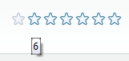

# Right-to-left Support


## 

The **RadRating** fully supports right-to-left (RTL) language locales. In order to turn on the RTL support you should set its **IsDirectionReversed** property to **true** as well as **dir=rtl to the html or body** elements or to its direct parent.

````ASPNET
	    <div dir="rtl">
	        <telerik:RadRating ID="RadRating" runat="server" ItemCount="7" IsDirectionReversed="true">
	        </telerik:RadRating>
	    </div>
````



# See Also

 * [See this live in an online demo](http://demos.telerik.com/aspnet-ajax/rating/examples/righttoleft/defaultcs.aspx)
