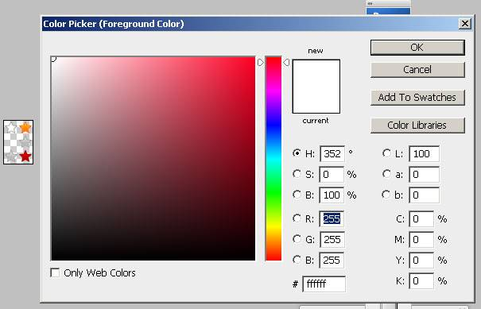
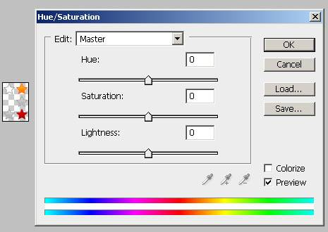
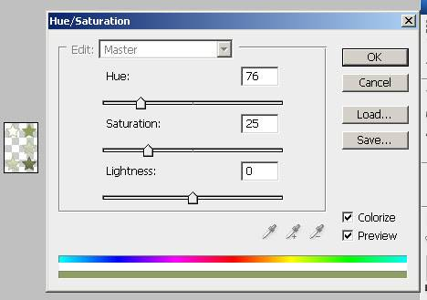

# Create a Custom Skin

## Abstract

Each of the controls included in the Telerik® UI for ASP.NET AJAX suite is styled with two css files that are loaded in a certain order. The first one - ControlName.css, also called base stylesheet contains CSS properties and values that are common for all skins, i.e it is layout-specific, not skin-specific. These are CSS float, padding, margin, font-size, font-family, etc. In the general case, when creating a custom skin for a control this file should not be edited, unless the custom skin needs different sizes, paddings or margins.

The second file represents the actual skin of the control, and its name consists of the control name plus the skin name, i.e - Rating.Default.css. Upon creating a custom skin for the control, one should edit that particular file, as it contains skin-specific CSS properties, and references to images, colors, borders and backgrounds.

## Creating a Custom Skin for RadRating for ASP.NET AJAX from an Existing One. Getting and Renaming Files and CSS Classes

A skin of RadRating consists of only one selector. All of the other settings are common for all designs and are stored in the control’s base style sheet (**Skins/Rating.css**).

In order to explain better the CSS classes of RadRating, we will use both **Rating.css** and **Rating.SkinName.css** as external resources. We will modify an existing skin of RadRating. Follow these steps to register an external skin for RadRating for ASP.NET AJAX before editing any CSS:

1. In your project, create a new directory named Skins

1. In the skins folder create a new directory MyCustomSkin.

1. Go to ~/[TelerikControlsInstallationFolder]/Skins and copy **Rating.css** in your Skins folder

1. Go to ~/[TelerikControlsInstallationFolder]/Skins/Default and copy **Rating.Default.css** and the **Skins/Default/Rating** folder in your Skins folder.

1. Rename **Rating.Default.css** to **Rating.MyCustomSkin.css** and the folder **Default** to **MyCustomSkin**.

1. When you are finished you should have the following files:

	1. **Skins/Rating.css**

	1. **Skins/MyCustomSkin/Rating.MyCustomSkin.css**

	1. **Skins/MyCustomSkin/Rating** with a single image in it – **Sprite.png**

1. In order to support multiple skins of RadRating on a single page, the wrapping skin-specific class is coined by the name of the control - RadRating plus underscore ("_") plus SkinName, i.e. **.RadRating_Default**, so in order to create a custom skin out of the Default skin, we should rename the sole occurrence of "Default" in **Rating.MyCustomSkin.css** to "MyCustomSkin" as shown below:

1. Add a new server declaration of RadRating on your page, and set Skin="MyCustomSkin", EnableEmbeddedSkins="false" and EnableEmbeddedBasestylesheet="false":

	**ASP.NET**

		<telerik:RadRating RenderMode="Lightweight" 
			ID="RadRating1" 
			runat="server" 
			Skin="MyCustomSkin" 
			EnableEmbeddedSkins="false"
			EnableEmbeddedBaseStylesheet="false" />

1. Register **Rating.css** and **Rating.MyCustomSkin.css** in the <head>...</head> section of your webpage. In order to have the CSS applied correctly, the base stylesheet should come first in the DOM:(Make sure the paths to the files are correct; otherwise the skin will not apply correctly)

	**HTML**

		<link rel="stylesheet" type="text/css" href="Skins/Rating.css"></link>
		<link rel="stylesheet" type="text/css" href="Skins/MyCustomSkin/Rating.MyCustomSkin.css"></link>

1. Reload the page, and if the steps 0-9 have been followed correctly, you will see RadRating running a custom Default skin set as an external resource.

## Explanation of the CSS class of Window.MyCustomSkin.css:

````XML
	.RadRating_MyCustomSkin a, .RadRating_MyCustomSkin a span
	{
		background-image: url('Rating/Sprite.png');
	}
````

## Understanding the Image Sprite (Sprite.png)

Sprite.png is a composite 36 x 54 image, which can be divided into 6 18 x 18 pixels zones, each one containing an image for a different state of the control, as shown below:


Due to the nature of the rendering, the normal hover state image should be present twice in the sprite.

## Modifying the Sprite.png to Achieve Totally New Looks for the Skin

Explained below is a simple method for modifying the image sprite of RadRating in Adobe PhotoShop to achieve new looks without creating a new design.

1. Open Sprite.png in Adobe PhotoShop

1. Press “Set Foreground Color” in PhotoShop's toolbox to open the color picker dialog

	

1. Select a color that you like from the color dialog and then close the dialog:

	

1. Select Image » Adjustments Hue » / Saturation to open the Hue / Saturation

	

1. Check “Colorize” in the Hue / Saturation dialog, and the image you have selected will be immediately colorized with the hue, saturation and lightness you have selected from the toolbox:

	 
	
	You may then play with the Hue, Saturation and Lightness sliders in order to fine-tune or further modify the image.

1. Press "OK" when you are finished to apply your setting to the image

1. Save and close the image

1. After you are over and done with this, save your work and reload the page. You will have a brand-new skin based on Telerik's Default skin of RadRating based on the hue / saturation approach described in this tutorial:


# See Also

 * [Understanding the Skin CSS File]()

 * [CSS Classes]()

 * [Telerik ThemeBuilder for ASP.NET AJAX](https://themebuilder.telerik.com/)


