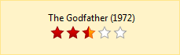

# Understanding the Skin CSS File

## Understanding the Skin CSS File

Styles for Telerik controls are defined using Cascading Style Sheet (CSS) syntax. Each style consists of a selector that identifies an HTML element to be styled, and property/value pairs that describe each of the style specifics, e.g. color, padding, margins, etc. See the [RadRating CSS selectors]() topic for more information on the specific CSS selectors used for RadRating skins.

Each style maps to a "class" attribute in an HTML tag. For example, consider the HTML rendering of a RadRating control:



Here is the HTML code that renders a horizontal RadRating, with 5 stars, and precision of a half an item. **Direction** is standard and the **Selection Mode** is continuous.

````HTML
<div style="padding: 15px 15px 15px 60px; float: left;">
	The Godfather (1972)
	<div class="RadRating RadRating_Default" id="RadRating1" style="width: 104px; height: 24px;">
		<ul class="rrtHalf">
			<li class="rrtSelected"><a href="#" title="1"><span>1</span> </a></li>
			<li class="rrtSelected"><a href="#" title="1.5"><span style="">2</span> </a></li>
			<li class="rrtSelected"><a href="#" title="2.5"><span style="width: 9px;">3</span> </a>
			</li>
			<li><a href="#" title="4"><span>4</span> </a></li>
			<li><a href="#" title="5"><span>5</span> </a></li>
		</ul>
		<input type="hidden" name="RadRating1_ClientState" id="RadRating1_ClientState" value="{&quot;value&quot;:&quot;2.5&quot;,&quot;readOnly&quot;:false}"
			autocomplete="off">
	</div>
</div>
````

The rating option is wrapped by a DIV element with CSS class **RadRating**, the second class **RadRating_Default** applies the styles of a specific skin, which in that case is the Default Skin. The rating stars are contained by an unordered list with class **rrtHalf**. That specifies the rating precision. In our case we have chosen **Half an Item**. If we choose to set the precision to **Whole Item** the class name will be changed to **rrtItem**, and to **rrtExact** if we set **Exact Precision**.

The **LI** element contains Anchor and Span element that contains the star and the rating (if you don't specify a class for that LI element, it is rendered in its normal state). Selected state is defined with the **rrtSelected** class, and on mouse on state is defined with the **rrtOver** class. The span could have an inline style specifying the width of the selected state which could be the whole item, half item or exact item rating.Rendering of other **RadRating** options use the same or very similar HTML semantics. The difference is in the used CSS classes that specify the number of the rating stars (or another rating element), rating precision, rating orientation, rating direction, and the selection mode. The CSS classes are named sensitively and it is easy to predict what their exact usage is.

# See Also

 * [Create a Custom Skin]()

 * [CSS Classes]()
