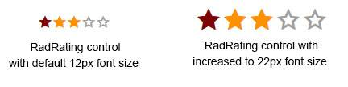

# Elastic Design

This article explains the **elastic design capabilities RadRating offers**.	RadRating, when in [Lightweight RenderMode](), uses font icons for its stars which provides its elastic capabilities.	The example below shows the simple approach you can use to resize and scale the control by only changing its default font size.

Generally, responsive design means that the page and its content are able to adapt to different screen resolutions without deteriorating the user experience.	This often includes changing the font size and having dimensions set in percent.

## Elastic Design with RadRating

>caption **Figure 1**: Comparison between a RadRating with the default 12px font size and with increased font-size



**RadRating** does not create elastic design by itself, but can fit in a page that follows this pattern. This means that you can change its font size without breaking the control's appearance - if the new size is larger than the original, the elements in the control will simply increase their size. This fluid layout is achieved by using `em` units for setting dimensions and paddings in the control, instead of `px` because em units are tied to the font size. This allows dimensions and sizes to scale with the font size.

**Example 1:** How to increase the font size of a RadRating as shown in **Figure 1**.

````XML
<style type="text/css">
	div.RadRating
		{
			font-size: 22px;
		}
</style>
<telerik:RadRating ID="RadRating1" runat="server" RenderMode="Lightweight">
</telerik:RadRating>
````

# See Also

 * [Render Modes]()
