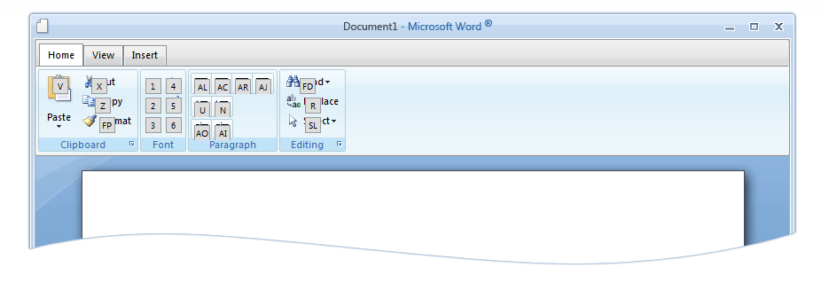

# Keyboard Support

RadRibbonBar Keyboard Support

## Keyboard Support

As of Q3 2011 RadRibbonBar introduces keyboars support. The new functionality is based on the Mircosoft's Ribbon specification for keyborad navigation.

A new section for configuration is added to the RadRibbonBar. The newly added section is called __KeyboardNavigationSettings__ and has three new properties:

* __Activated__ : this property auto enables key hints on page load.

* __CommandKey__ : used with the FocusKey to focus the RadRibbonBar. By default this property is set to use the __Alt__ key, but it could be changed to something else from the following enumeration:

1. Alt

1. Ctrl

1. Shift

1. AltShift

1. AltCtrl

1. CtrlShift

* __FocusKey__: focus key used with the CommandKey. By default this property is set to use the __Q__ key. Again there is an enumaration, so other key could be used as focus key.

For every item of the RadRibbonBar a specific access key should be set using its __AccessKey__ property. Once the keyboard navigation is enabled and the control is focused, the access keys of the currently active items will be shown as hints over them:

In order to move one level up in a specific collection the __Esc__ key should be used.

The full Microsoft Ribbon Specification could be found [here](http://msdn.microsoft.com/en-us/library/windows/desktop/cc872782.aspx#accessKeysAndKeytips)

# See Also

 * [Online demo](http://demos.telerik.com/aspnet-ajax/ribbonbar/examples/keyboardsupport/defaultcs.aspx)
