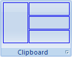
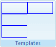

# Item Sizes


This article aims at explaining the meaning of RibbonBarItemSize in the rendering of RadRibbonBar.

## Flow of items inside RibbonBarGroup

RibbonBarGroup holds all RibbonBarItems.

The order of these controls is made in the following rule – there are n columns in a group and each column has 3 lines. Also 1 line doesn’t necessarily mean 1 item – items are rendered on 1 line or 1 full column (3 lines).

## Regular Items

There are 3 sizes supported for regular items:

* Small;

* Medium;

* Large.

Small size means that the item is rendered only with a small image and it takes a single line in the current column of the current group.

Medium-sized items are rendered with small image, but they display the Text property of the item and also take a single line.

Large items are rendered with large image, they have text and take 3 lines, which is equal to 1 column (1column = 3 lines).

Consider the following example:

* There is a group with 1 large item and consequent 3 medium items – here is how does it look:

* And as you can see, the large item, has the entire column, while the medium-sized items are getting only one line. Here is a bit simplified and more obvious:

## RibbonBarTemplateItem

1. **Columns and Lines**RibbonBarTemplateItem practically has only 2 supported sizes, since there is no default text to display, and only its content is rendered – small (Small and Medium – 1 line) and large (Large – 3 lines). This means that if you have 3 non-large (for sake of simplicity) RibbonBarTemplateItems, they should be aligned in a single column, while 3 large RibbonBarTemplateItems, should be placed in 3 separate columns.

1. **Height and Width**The height of non-large items is rendered with style height: 22px, hence your items should not go beyond that if you set them to be non-large.Here is an example of 3 non-large template items declaration:

````ASPNET
				<telerik:RibbonBarGroup Text="Templates">
					<Items>
				        <telerik:RibbonBarTemplateItem>
							<div style="border: solid 1px blue; height: 22px; width: 50px;">
							</div>
				        </telerik:RibbonBarTemplateItem>
						<telerik:RibbonBarTemplateItem>
							<div style="border: solid 1px blue; height: 22px; width: 50px;">
							</div>
				        </telerik:RibbonBarTemplateItem>
						<telerik:RibbonBarTemplateItem>
							<div style="border: solid 1px blue; height: 22px; width: 50px;">
							</div>
				        </telerik:RibbonBarTemplateItem>
					</Items>
				</telerik:RibbonBarGroup>
````

And here is how the group is rendered:The overflow of the container (rrbTemplate) is set to visible => if the first item is declared with 30px height it will not affect the flow of the controls (the alignment will be the same, only the first item will render through the rest of the column without pushing them on the vertical axis more than the preset 22px).Here is how it would render (the color is changed to red, too):The overflow:visible is set, because we want to enable you to use controls opening a dropdown.**Note**: if you need to open a spanning outside the RibbonBar dropdown which is not absolutely positioned, you should set your RibbonBar to Width=”100%” (disable the resize) and the following style to the page:

````ASPNET
	div.RadRibbonBar .rrbButtonArea
	{
	    overflow: visible;
	}
````

Large items are rendered on a single column – here is a declaration of a large item containing all 3 previously wrapped in separate items div elements:

````ASPNET
						<telerik:RibbonBarTemplateItem Size="Large">
							<div style="border: solid 1px blue; height: 22px; width: 50px;">
							</div>
							<div style="border: solid 1px blue; height: 22px; width: 50px;">
							</div>
							<div style="border: solid 1px blue; height: 22px; width: 50px;">
							</div>
						</telerik:RibbonBarTemplateItem>
````

And this is rendered exactly the same as previously:But if you add another template item and make the group declaration as follows:

````ASPNET
				<telerik:RibbonBarGroup Text="Templates">
				    <Items>
				        <telerik:RibbonBarTemplateItem Size="Large">
							<div style="border: solid 1px blue; height: 22px; width: 50px;">
							</div>
							<div style="border: solid 1px blue; height: 22px; width: 50px;">
							</div>
							<div style="border: solid 1px blue; height: 22px; width: 50px;">
							</div>
				        </telerik:RibbonBarTemplateItem>
				        <telerik:RibbonBarTemplateItem>
							<div style="border: solid 1px blue; height: 22px; width: 50px;">
							</div>
				        </telerik:RibbonBarTemplateItem>
				    </Items>
				</telerik:RibbonBarGroup>
````

The second item is in a separate column:And it will be in a separate column even if one of the div’s in the first item is missing:
