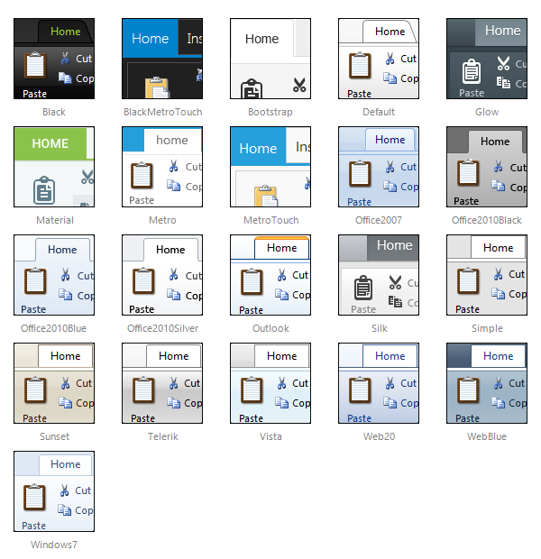

# Skins

## 

To make customizing the appearance of **RadRibbonBar** as easy as possible, the control uses **predefined skins.** A skin is a set of images and a CSS stylesheets that can be applied to the elements (items, images, etc.) of the control and thus define their look and feel. To apply a skin to the ribbonbar, set its **Skin** property, either using the properties pane or the **RadRibbonBar** [ Smart Tag ]().

The control comes with a number of built-in skins:

 

 @[template - Material skin is available only in Lightweight mode](/_templates/common/skins-notes.md#material-only-in-lightweight) 

## See Also

 * [Telerik ThemeBuilder for ASP.NET AJAX](https://themebuilder.telerik.com/)

