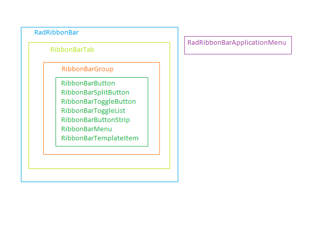

# Client-side Programming Overview


## 

**RadRibbonBar** provides a flexible client-side API that allows you to interact with the RibbonBar – RibbonBarMenu, RibbonBarMenuItems collection and individual RibbonBarButtons, all on the client side. Here is the basic structure of a simple RadRibbonBar control and its elements:



Given the following markup there are some examples of how you can get different elements of the RadRibbonBard control.

````ASPNET
<telerik:RadRibbonBar RenderMode="Lightweight" runat="server" ID="RadRibbonBar1" OnClientLoad="OnClientLoad"
	OnClientButtonClicking="OnClientButtonClicking">
	<telerik:RibbonBarTab Text="Tab0" Value="Tab0Value">
		<telerik:RibbonBarGroup Text="Group0" Value="Group0Value">
			<Items>
				<telerik:RibbonBarButton Text="RibbonBarButton0" Size="Medium" Value="RibbonBarButton0Value" />
				<telerik:RibbonBarButton Text="RibbonBarButton1" Size="Medium" Value="RibbonBarButton1Value" />
				<telerik:RibbonBarButton Text="RibbonBarButton2" Size="Medium" Value="RibbonBarButton2Value" />
			</Items>
		</telerik:RibbonBarGroup>
	</telerik:RibbonBarTab>
	<telerik:RibbonBarTab Text="Tab1" Value="Tab1Value">
		<telerik:RibbonBarGroup Text="Group1" Value="Group1Value">
			<Items>
				<telerik:RibbonBarMenu ID="RibbonBarMenu" Text="RibbonBarMenu1">
					<Items>
						<telerik:RibbonBarMenuItem Text="RibbonBarMenuItem0" Value="0">
						</telerik:RibbonBarMenuItem>
						<telerik:RibbonBarMenuItem Text="RibbonBarMenuItem1" Value="1">
						</telerik:RibbonBarMenuItem>
						<telerik:RibbonBarMenuItem Text="RibbonBarMenuItem2" Value="2">
						</telerik:RibbonBarMenuItem>
					</Items>
				</telerik:RibbonBarMenu>
			</Items>
		</telerik:RibbonBarGroup>
	</telerik:RibbonBarTab>
	<telerik:RibbonBarTab Text="Tab2" Value="Tab2Value">
		<telerik:RibbonBarGroup Text="Group2" Value="Group2Value">
			<Items>
				<telerik:RibbonBarToggleList>
					<ToggleButtons>
						<telerik:RibbonBarToggleButton Size="Medium" Text="RibbonBarToggleButton0"  Value="RibbonBarToggleButton0Value"/>
						<telerik:RibbonBarToggleButton Size="Medium" Text="RibbonBarToggleButton1"  Value="RibbonBarToggleButton1Value"/>
					</ToggleButtons>
				</telerik:RibbonBarToggleList>
			</Items>
		</telerik:RibbonBarGroup>
	</telerik:RibbonBarTab>
</telerik:RadRibbonBar>
````


## Getting the RadRibbonBar client-side object

RadRibbonBar creates a client-side object with the **ClientID** of the ribbonbar. You can obtain the reference using the following JavaScript code:

````JavaScript
	
var ribbonBar = $find("<%= RadRibbonBar1.ClientID %>");
// or...
var ribbonbar = $find("RadRibbonBar1");	
	
````


## Getting an instance of a particular RibbonBarTab

Once you have the client-side object of **RadRibbonBar**, you can use the **findTabByValue()** method to get the instance of a particular tab:

````JavaScript
	          
function OnClientLoad(sender, args) {

	var ribbonbar = $find("RadRibbonBar1");
	var tab0 = ribbonbar.findTabByValue("Tab0Value");
	tab0.set_text("NewTab0");
}

````


## Getting an instance of a particular RibbonBarGroup

Now that you have the RibbonBarTab object you can easily get the **Group** object directly from the ribbonbar using the **findGroupByValue()** method.

````JavaScript

function OnClientLoad(sender, args) {

	var ribbonbar = $find("RadRibbonBar1");
	var tab0 = ribbonbar.findTabByValue("Tab0Value");
	tab0.set_text("NewTab0");

	var group0 = ribbonbar.findGroupByValue("Group0Value");
	group0.set_text("NewGroup0");
}

````


## Getting an instance of a particular RibbonBarButton

By using the **findButtonByValue()** method you could get the instance of a particular **RibbonBarButton** :

````JavaScript

function OnClientLoad(sender, args) {

	var ribbonbar = $find("RadRibbonBar1");
	var button0 = ribbonbar.findButtonByValue("RibbonBarButton0Value");
	button0.set_enabled(false);	
}	
			
````


## Getting an instance of a particular RibbonBarToggleButton

Also using the **findToggleButtonByValue()** method you can find a particular button in the **RibbonBarToggleList** collection

````JavaScript

function OnClientLoad(sender, args) {

	var ribbonbar = $find("RadRibbonBar1");
	var togglebutton = ribbonbar.findToggleButtonByValue("RibbonBarToggleButton0Value");
	togglebutton.set_enabled(false);
}
	
````


>note You can not operate with the RibbonBarToggleList by itself. In other words if you intend to disable the RibbonBarToggleList you will not be able to do so since it does not render as an object. Instead you will need to disable each RibbonBarToggleButton individually. The same apply for the RibbonBarMenu as well.
>


## Getting an instance of a particular RibbonBarMenuItem

````JavaScript
	
function OnClientLoad(sender, args) {

	var ribbonbar = $find("RadRibbonBar1");
	var menuItem = ribbonbar.findMenuItemByValue("0");
	menuItem.set_enabled(false);				
}
	
````


>note In addition to the above mentioned methods you can also find a particular tab, group or item by using indexes in the following way:
>


````JavaScript
				
function OnClientLoad(sender, args) {

	var ribbonbar = $find("RadRibbonBar1");
	var tab0 = ribbonbar.get_tabs().getTab(0);
	//tab0.set_text("NewTab0");
	var group0 = tab0.get_groups().getGroup(0);
	//group0.set_text("NewGroup0");
	var item0 = group0.get_items().getItem(0);
	//returns the text of the first button in the first group of the first tab
	alert(item0.get_text());
}
	
````


## Cancelling an action

Several client side events occur immediately before the ribbonbar performs some action. Most of these events all have names that end in "-ing". You can use these events to cancel the ribbonbar action by using the **set_cancel()** method of the eventArgs passed to the handler:

````JavaScript
	
function OnClientButtonClicking(sender, args) {
    args.set_cancel(true);
}
	
````


# See Also

 * [Client Events](https://demos.telerik.com/aspnet-ajax/RibbonBar/Examples/Events/ClientSide/DefaultCS.aspx)

 * [Client-side Events Overview]()
