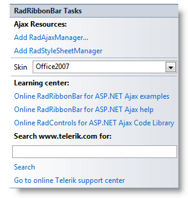
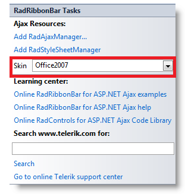

# Design Time

The **RadRibbonBar** Smart Tag allows easy access to frequently needed tasks. You can display the Smart Tag by right clicking on a **RadRibbonBar** control in the design window, and choosing **Show Smart Tag**.

## Smart Tag

**RadRibbonBar's** Smart Tag looks like the following:

Using the**RadRibbonBar** Smart Tag you can perform the following:

## Ajax Resources

* **Add RadAjaxManager...** adds a RadAjaxManager component to your Web page, and displays the **r.a.d.ajax Property Builder** where you can configure it.

* Add **RadStyleSheetManager** adds a **RadStyleSheetManager** to your Web page.

## Skin

The **Skin** drop-down lets you preview the built-in [skins](F027C770-AAB1-4942-8908-0E448B952734) and select one for your menu.

## Learning Center

Links navigate you directly to RadRibbonBar examples, help, or code library. You can also search the Telerik web site for a given string.
