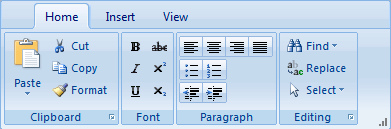

# RibbonBar Overview

## 

__RadRibbonBar__ is the newest addition to the suite of RadControls for ASP.NET AJAX, brings the ability to create rich toolboxes, which typically cannot be seen in web applications. We are trying to follow the development guidelines of Microsoft Ribbon specification and to give it the look and feel you can find in many modern applications today such as those found in Microsoft Office.The Telerik ASP.NET AJAX RibbonBar control allows you to easily organize the navigation of your application in a simple, structured way. What is more, RadRibbonBar mimics the UI of the RibbonBar used in Microsoft Office 2007, thus providing your end-users with a familiar way to navigate around your application.

In the first version of the control, we are presenting the following tools, which you can use to build your RadRibbonBar:

* __[Application Menu]()__

* __[RibbonBarGallery]()__

* __[RibbonBarTab]()__

* __[RibbonBarGroup]()__

* __[RibbonBarButton]()__

* __[RibbonBarMenu]()__

* __[RibbonBarSplitButton]()__

* __[RibbonBarButtonStrip]()__

* __[RibbonBarToggleButton]()__

* __RibbonBarToggleList.__

* __[RadRibbonBarDropDown]()__

* __[RibbonBarComboBox]()__

* __[RibbonBarNumericTextBox]()__

* __[RadRibbonBarColorPicker]()__

The Tab and Group are structure-only elements. The Menu, SplitButton and ToggleList are both structure and logic elements. The Button and the ToggleButton are action-only elements. Finally, the ButtonStrip is appearance-only element (changes the look of contained elements).

Important thing to note about the current event model is that all the event handlers are being assigned in the main RadRibbonBar tag, in order to try making declarations more structured, consistent and easy to read. Check the events examples in the "Events" section.

One of the truly unique features this control is offering is its client resizing. It should mimic the resizing behavior of Microsoft Ribbon control and while still work in progress it can collapse/expand groups and buttons. You need to specify the Size property of all action items which defines the default state of a button which can be Small/Medium or Large and while big sizes can collapse to small, expanding the button size only works up to its original Size.

* __Overlay support__. RadRibbonBar can display its items over IE windowed objects suchHTML select boxes, Flash movies, and so on. This built-in feature does not need to be set explicitly through a property.

* Support for all major browsers, including Internet Explorer 5.5 and above, Netscape 7.0 and above (PC -- Netscape 7.1 for Mac and Linux), Mozilla 1.0 and above (all operating systems),Firefox 0.8 and above (all operating systems), Opera 7.5 and above, and Safari 1.3 and above.

