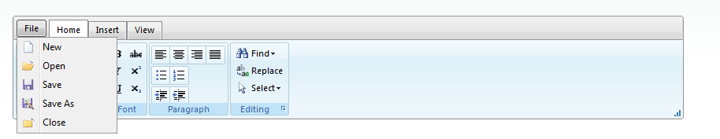

# Application Menu


## Overview

Since an Application Menu is a mandatory element in any Ribbon application, the Telerik **RadRibbonBar** control also has its specially designed RadRibbonbarApplicationMenu. It enables you to create an application menu similar to the one found in Microsoft Office 2007 and 2010. The **RadRibbonBarApplicationMenu** is a new addition to the Telerik's **RadRibbonBar** control, that allows to enrich your experiences with the current control. Using this menu you have the possibility to add a list of 'application commands' to the tab row of the control. These commands are contained in a drop down, which opens when clicking on the first 'tab' of the **RibbonBar**. The commands have Text, Value and ImageUrl properties.

>note It is important to note that as of **Q2 2013** we changed the look and feel of the **ApplicationMenu** . The purpose of the new **ApplicationMenu** is to follow the Microsoft's specification as close as possible, without breaking existing code. Below you can find two image files - the first one represents the current new look of the RadRibbonBarApplicationMenu while the second one exemplifies the old look.
>




## Structure

In general with the new ApplicationMenu we preserved the already existing structure, classes and properties of the RibbonBarApplicationMenu (the old code is still relevant). The change that the end user can notice consists of the overall appearance of the menu. In addition to that, the ApplicationMenu also includes the following improvements:

* **RibbonBarApplicationSplitMenuItem** - a type of menu item that has a default action and button area. An additional split button arrow opens a popup with child menu items. The popup has a header that can be controlled by the SplitMenuItems’ **Header** property.

* **Description** - property that is applied to the existing RibbonBarApplicationMenuItem.

* **AuxiliaryPane** - this pane serves as a template holder for the user where any control can be inserted.

* **FooterPane** - this pane serves as a template holder for the user to insert any additional control.

````ASPNET

<ApplicationMenu Text="File">
	<Items>
		<telerik:RibbonBarApplicationMenuItem Text="New" ImageUrl="icons/file/New.png" />
		<telerik:RibbonBarApplicationMenuItem Text="Open" ImageUrl="icons/file/Open.png" />
		<telerik:RibbonBarApplicationMenuItem Text="Save" ImageUrl="icons/file/Save.png" />
		<telerik:RibbonBarApplicationSplitMenuItem Text="Save As" ImageUrl="icons/file/SaveAs.png" Header="Save document as">
            <Items>
		        <telerik:RibbonBarApplicationMenuItem Text="Word Document (*.docx)" ImageUrl="icons/file/Document.png" />
		        <telerik:RibbonBarApplicationMenuItem Text="Word 97-2003 Document (*.doc)" ImageUrl="icons/file/Document.png" />
		        <telerik:RibbonBarApplicationMenuItem Text="PDF (*.pdf)" ImageUrl="icons/file/Document.png" />
		        <telerik:RibbonBarApplicationMenuItem Text="Web Page (*.htm;*.html)" ImageUrl="icons/file/Document.png" />
		        <telerik:RibbonBarApplicationMenuItem Text="Plain Text (*.txt)" ImageUrl="icons/file/Document.png" />
            </Items>
		</telerik:RibbonBarApplicationSplitMenuItem>
		<telerik:RibbonBarApplicationMenuItem Text="Close" ImageUrl="icons/file/Close.png" />
	</Items>
    <AuxiliaryPane Header="Recent Documents">
        <ContentTemplate>
            <ol>
                <li>Document 1.doc</li>
                <li>Document 2.doc</li>
                <li>Document 3.doc</li>
                <li>Document 4.doc</li>
                <li>Document 5.doc</li>
            </ol>
        </ContentTemplate>
	</AuxiliaryPane>
</ApplicationMenu>

````


## Working with Items of the Application Menu on the Client-Side

**RadRibbonBar** provides a client-side API for working with items of the RibbonBarApplicationMenu. Below you can find an example how you can find a particular item of the Application Menu when using a client side events different than the [OnClientApplicationMenuItemClicking]()/ [OnClientApplicationMenuItemClicked]().

````JavaScript
	
function OnClientButtonClicking() {

	var menu = $find("RadRibbonBar1")._applicationMenuDropDown;
	var item1 = menu.get_items().getItem(0);
	//get the first item from the application menu
	//disables the first item from the application menu
	item1.set_enabled(false);
}
	
````


````ASPNET

<telerik:RibbonBarApplicationMenu ID="ApplicationMenu1" runat="Server" >
		<Items>
			<telerik:RibbonBarApplicationMenuItem Text="Item1" />
			<telerik:RibbonBarApplicationMenuItem Text="Item2" />
			<telerik:RibbonBarApplicationMenuItem Text="Item3" />
			<telerik:RibbonBarApplicationMenuItem Text="Item4" />
			<telerik:RibbonBarApplicationMenuItem Text="Item5" />
			<telerik:RibbonBarApplicationMenuItem Text="Item6" />
		</Items>
	</telerik:RibbonBarApplicationMenu>
<telerik:RadRibbonBar RenderMode="Lightweight" ID="RadRibbonBar1" runat="server"  OnClientButtonClicking="OnClientButtonClicking" ApplicationMenuID="ApplicationMenu1"/>
	
````


# See Also

 * [Online Demo](https://demos.telerik.com/aspnet-ajax/ribbonbar/examples/applicationmenu/defaultcs.aspx)

 * [ApplicationMenuItemClick]()

 * [OnClientApplicationMenuItemClicking]()

 * [OnClientApplicationMenuItemClicked]()
