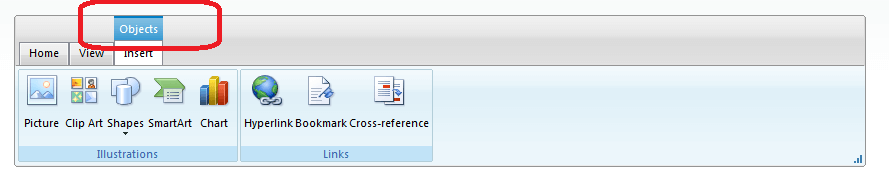

# Contextual Tabs


## 

RadRibbonBar's contextual tabs allows you to group a number of tabs based on some context. Contextual tabs are contained in a contextual tab group and following Microsoft's Ribbon specification they are positioned always last, after the normal set of tabs.

It is also important to note that the contextual tab groups are inactive by default. Therefore in order to enable them you will need to set their **Active** property to **true**. For example here is sample code that demonstrates the basic structure of the contextual tab group:

````ASPNET
		
<telerik:RadRibbonBar RenderMode="Lightweight" runat="server" id="RadRibbonBar1">
	<ContextualTabGroups>
		<telerik:RibbonBarContextualTabGroup Text="Objects" Active="true">
			<telerik:RibbonBarTab Text="Home" Value="Home">
				<telerik:RibbonBarGroup Text="Links" Value="Links">
					<Items>
						<telerik:RibbonBarButton Text="HyperLink" Size="Medium" Value=" HyperLink " />
						<telerik:RibbonBarButton Text="Bookmark" Size="Medium" Value=" Bookmark " />
					</Items>
				</telerik:RibbonBarGroup>
			</telerik:RibbonBarTab>
		</telerik:RibbonBarContextualTabGroup>
	</ContextualTabGroups>
</telerik:RadRibbonBar>
````




There are two modes in which RadRibbonBar's contextual tabs operate:

## Server-side

Using this mode means that only active contextual tab groups are rendered by default. Activating/deactivating contextual tab groups happens on the server only. Therefore this method is useful when the RibbonBar is in a UserControl so that it could be used in more than one page where each context would depend on the current page.

## Client-side

If the RenderInactiveContextualTabGroups property is set to true, the inactive groups will be rendered and send to the browser. Thus, they will be initially invisible. They can be activated and active groups can be deactivated dynamically on the page with the client-side API.

# See Also

 * [Contextual Tabs](https://demos.telerik.com/aspnet-ajax/ribbonbar/examples/contextualtabs/defaultcs.aspx)
