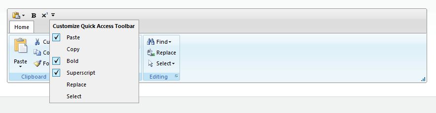

# Quick Access Toolbar

## 

The Quick Access Toolbar is listed in the title bar of the control. It allows you to choose the most used RadRibbonBar commands that are currently available and put their shortcuts in the title bar of the control. The shortcuts function in the same way as the original commands - they fire both their client-side and server-side events. All types of commands (Button, Split Button, Menu, Toggle Button) are supported.

Additionally the drop down of the QAT allows the user to hide/show those commands they do or do not need at the moment of interaction with the control.

Configuring the Quick Access Toolbar is straightforward:

* RadRibbonBar.**EnableQuickAccessToolbar**

* **False** (default) - disables the QAT.

* **True** - enables the QAT (allows the buttons whose QuickAccess property is set to true).

* RibbonBar[Button|SplitButton|Menu|ToggleButton].**QuickAccess**

* **Disabled** (default) - the command does not appear in the QAT.

* **Active** - the command is added to the QAT and is immediately available for usage.

* **Inactive** - the command is added to the QAT but is not immediately available for usage. Can be shown by checking its corresponding option in the QAT drop down.

# See Also

 * [Quick Access Toolbar](http://demos.telerik.com/aspnet-ajax/ribbonbar/examples/quickaccesstoolbar/defaultcs.aspx)
