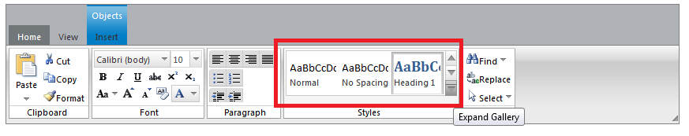

# RibbonBarGallery


**Galleries** are functionally and graphically rich list box controls. The item collection of a gallery can be organized by categories, displayed in flexible column and row-based layouts, represented with images and text, and depending on the type of gallery, support live previewing.

## RibbonBarGallery

>tip The RibbonBarGallery is available after the **Q2 2013** release of the RadControls controls.
>


The **RibbonBarGallery** has a collection of **RibbonBarGalleryCategories**, which in turn have a collection of **RibbonBarGalleryItems.** The RibbonBarGallery has 3 buttons on the right that enables scrolling and expanding of the Gallery. The top and middle buttons are used to scroll the items inline up and down one row at a time, while the bottom button expands the Gallery. The expanded Gallery enables the customization of the height set - it can be altered with the **ExpandedHeight** property as described below.

Here you can find a sample markup demonstrating how to build your first RibbonBarGallery:

````ASPNET
<telerik:RadRibbonBar RenderMode="Lightweight" ID="RadRibbonBar1" runat="server" OnClientGalleryCommandPreview="OnClientGalleryCommandPreview"
    OnClientGalleryCommandPreviewEnd="OnClientGalleryCommandPreviewEnd" OnClientGalleryCommand="OnClientGalleryCommand"
    OnGalleryCommand="OnGalleryCommand">
    <Tabs>
        <telerik:RibbonBarTab Text="Tab">
            <telerik:RibbonBarGroup Text="Group">
                <Items>
                    <telerik:RibbonBarGallery CommandName="GalleryCommand" Columns="5" ExpandedColumns="8"
                        ExpandedHeight="300px" ItemHeight="32px" ItemWidth="32px" ItemTextPosition="Bottom">
                        <telerik:RibbonBarGalleryCategory Title="FirstCategory">
                            <telerik:RibbonBarGalleryItem CommandArgument="GalleryItemArgument" Text="Item" ToolTip="Item"
                                ImageUrl="Image.png" CssClass="ImageCssClass" />
                        </telerik:RibbonBarGalleryCategory>
                        <telerik:RibbonBarGalleryCategory>
                            <telerik:RibbonBarGalleryItem CommandArgument="GalleryItemArgument" Text="Item" ToolTip="Item"
                                ImageUrl="Image.png" CssClass="ImageCssClass" />
                        </telerik:RibbonBarGalleryCategory>
                    </telerik:RibbonBarGallery>
                </Items>
            </telerik:RibbonBarGroup>
        </telerik:RibbonBarTab>
    </Tabs>
</telerik:RadRibbonBar>
````


Listed below are some important properties of the RibbonBarGallery:

* **CommandName** - The CommandName that is passed as a parameter to the RibbonBar’s OnCommand or OnGalleryCommand event.

* **ItemTextPosition** - property that can take values of Bottom, Inline and None. It controls the position of the text relative to the image of each GalleryItem inside the Gallery.

* **ExpandedHeight** - property that sets the height of the Gallery when expanded.

* **ItemHeight** - property that sets the height of each GalleryItem inside the Gallery.

* **ItemWidth** - property that sets the width of each GalleryItem inside the Gallery.

* **Columns** - property that sets the number of columns that the GalleryItems should be displayed in.The Gallery itself does not have a Width property therefore the Width is calculated to fit the exact number of items horizontally as specified in the Columns property.

* **ExpandedColumns** - property that sets the number of columns when the Gallery is expanded.

## Server-Side Interaction

The **RibbonBarGallery** will raise the following server-side event:

* **OnGalleryCommand** - raised on the server when the user clicks a GalleryItem.

>tip The **RibbonBarGallery** will also fire the ribbon’s **OnCommand** event with the respective **CommandName** and **CommandArgument** arguments.
>


## Client-Side Interaction

The **RibbonBarGallery** will raise the following client-side events:

* **[OnClientGalleryCommandPreview ]()**– raised on the client when the user moves the mouse over a GalleryItem

* **[OnClientGalleryCommandPreviewEnd ]()**- raised on the client when the user moves the mouse out of a GalleryItem

* **[OnClientGalleryCommand]()**– raised on the client when the user clicks a GalleryItem
