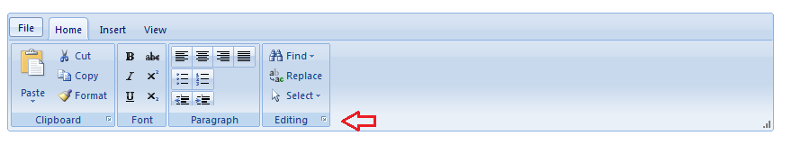

# Structure

## 

The RibbonBar is a container that holds different types of items. There are a few types of items that can appear in the toolbar:

* **Application Menu**: the ApplicationMenu is specially designed for the RadRibbonbar control. It enables you to create an application menu similar to the one found in Microsoft Office 2007 and 2010.

* **Buttons**: RibbonBar buttons (**RibbonBarButton**) are buttons that the user can click to perform some task.

* **Contextual Tabs**: RadRibbonBar's contextual tabs allows you to group a number of tabs based on some context. Contextual tabs are contained in a contextual tab group and following Microsoft's Ribbon spec they are positioned always last, after the normal set of tabs.

* **Groups**: RibbonBarGroup is a container for other ribbon bar items. Each RibbonBar can have several number of **RibbonBarGroup** items.

* **Menus**: Menus (**RibbonBarMenu**) do not perform a task. Instead, when the user clicks a menu item, it displays its **child menu items**. The menu item contains one or more menu items that the user can click to perform some task.

* **Split Buttons**: Split buttons (**RibbonBarSplitButton**) combine the features of buttons and menu items. When the user clicks on a split button, it performs a task like a toolbar button. When the user clicks on the drop-down arrow, it opens a **drop-down list**, where the user can click on a ribbonbar button.

* **Tabs**: The RibbonBar consists of a hierarchy of tabs. The tabs on one level are exposed when the parent tab on the previous level is selected. Each tab is represented by a **RibbonBarTab** instance.

* **Toggle Buttons**: Toggle button (**RibbonBarToggleButton**) is a button that represents a setting with two states - on and off. Users can click toggle buttons to turn a setting on or off. For instance, to switch between italic and plain style in selected text.

* **Quick Access ToolBar**: The Quick Access Toolbar allows you to choose the most used RadRibbonBar commands that are currently available and put shortcuts to them in the title bar of the control.

When the RadRibbonBar control is selected, the properties pane on the right side enables you configure it by setting its properties. Here are some of them:

* **ToolTip** - With the **Q2 2012 version** of the Telerik controls RadRibbonBar control has enhanced ToolTips that enable you to completely describe the associated command and thus reduce the need for related Help. The following illustration shows the Enhanced tooltip for a ribbon control.

* **Minimize** - With the **Q2 2012 version** of the Telerik controls RadRibbonBar control supports expanding/collapsing of the control. To get this functionality you will need to set the **EnableMinimizing** property to **true**. In addtion to this, in case you need the control to be minimized on load, you can use the **Minimize** property of the RadRibbonBar and set it to **true**.
