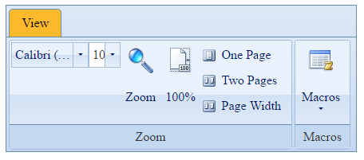

# XML Export & Import


RadRibbonBar supports Export and Import to XML data.

## XML Export

Here is sample RadRibbonBar declaration:

````ASPNET
<telerik:RadRibbonBar RenderMode="Lightweight" Skin="Office2007" ID="RadRibbonBar1" runat="server">
    <telerik:RibbonBarTab Text="View">
        <telerik:RibbonBarGroup Text="Zoom">
            <Items>
                <telerik:RibbonBarControlGroup Orientation="Horizontal">
                    <telerik:RibbonBarDropDown Width="97">
                        <Items>
                            <telerik:RibbonBarListItem Text="Arial" />
                            <telerik:RibbonBarListItem Text="Calibri (body)" Selected="true" />
                            <telerik:RibbonBarListItem Text="Comic Sans" />
                        </Items>
                    </telerik:RibbonBarDropDown>
                    <telerik:RibbonBarComboBox Width="40">
                        <Items>
                            <telerik:RibbonBarListItem Text="8" />
                            <telerik:RibbonBarListItem Text="9" />
                            <telerik:RibbonBarListItem Text="10" Selected="true" />
                        </Items>
                    </telerik:RibbonBarComboBox>
                </telerik:RibbonBarControlGroup>
                <telerik:RibbonBarToggleList>
                    <ToggleButtons>
                        <telerik:RibbonBarToggleButton Size="Large" Text="Zoom" ImageUrl="Images/Icons/view/Zoom.png"></telerik:RibbonBarToggleButton>
                        <telerik:RibbonBarToggleButton Size="Large" Text="100%" ImageUrl="Images/Icons/view/100.png"></telerik:RibbonBarToggleButton>
                    </ToggleButtons>
                </telerik:RibbonBarToggleList>
                <telerik:RibbonBarToggleList>
                    <ToggleButtons>
                        <telerik:RibbonBarToggleButton Size="Medium" Text="One Page" ImageUrl="Images/Icons/view/One_Page.png"></telerik:RibbonBarToggleButton>
                        <telerik:RibbonBarToggleButton Size="Medium" Text="Two Pages" ImageUrl="Images/Icons/view/Two_Pages.png"></telerik:RibbonBarToggleButton>
                        <telerik:RibbonBarToggleButton Size="Medium" Text="Page Width" ImageUrl="Images/Icons/view/Page_Width.png"></telerik:RibbonBarToggleButton>
                    </ToggleButtons>
                </telerik:RibbonBarToggleList>
            </Items>
        </telerik:RibbonBarGroup>
        <telerik:RibbonBarGroup Text="Macros">
            <Items>
                <telerik:RibbonBarSplitButton Size="Large" Text="Macros" ImageUrl="Images/Icons/view/Macros.png">
                    <Buttons>
                        <telerik:RibbonBarButton Text="View Macros" ImageUrl="Images/Icons/view/Macros.png"></telerik:RibbonBarButton>
                        <telerik:RibbonBarButton Text="Record Macro..." ImageUrl="Images/Icons/view/Macros_Record.png"></telerik:RibbonBarButton>
                    </Buttons>
                </telerik:RibbonBarSplitButton>
            </Items>
        </telerik:RibbonBarGroup>
    </telerik:RibbonBarTab>
</telerik:RadRibbonBar>
````


And this is the result of calling the RadRibbonBar1.GetXml() method:

````XML
<?xml version="1.0" encoding="utf-16"?>
<RibbonBar Skin="Office2007" EnableAjaxSkinRendering="False" RenderMode="Lightweight">
  <Tab Text="View">
    <Group Text="Zoom">
      <ControlGroup Orientation="Horizontal">
        <DropDown Width="97px">
          <ListItem Text="Arial" />
          <ListItem Text="Calibri (body)" Selected="True" />
          <ListItem Text="Comic Sans" />
        </DropDown>
        <ComboBox Text="10" Width="40px">
          <ListItem Text="8" />
          <ListItem Text="9" />
          <ListItem Text="10" Selected="True" />
        </ComboBox>
      </ControlGroup>
      <ToggleList>
        <ToggleButton ImageUrl="Images/Icons/view/Zoom.png" Size="Large" Text="Zoom" />
        <ToggleButton ImageUrl="Images/Icons/view/100.png" Size="Large" Text="100%" />
      </ToggleList>
      <ToggleList>
        <ToggleButton ImageUrl="Images/Icons/view/One_Page.png" Size="Medium" Text="One Page" />
        <ToggleButton ImageUrl="Images/Icons/view/Two_Pages.png" Size="Medium" Text="Two Pages" />
        <ToggleButton ImageUrl="Images/Icons/view/Page_Width.png" Size="Medium" Text="Page Width" />
      </ToggleList>
    </Group>
    <Group Text="Macros">
      <SplitButton ImageUrl="Images/Icons/view/Macros.png" Size="Large" Text="Macros">
        <Button ImageUrl="Images/Icons/view/Macros.png" Text="View Macros" />
        <Button ImageUrl="Images/Icons/view/Macros_Record.png" Text="Record Macro..." />
      </SplitButton>
    </Group>
  </Tab>
</RibbonBar>
````


## XML Import

The reverse process is also implemented - XML Import (LoadXml and LoadContentFile). The LoadXml is used to load the content from a XML as string while LoadContentFile gets the content from a XML file.

If there were 2 RibbonBar declarations in the above sample (second one empty), it's that simple to reload the first in the second one:

````C#
RadRibbonBar2.LoadXml(RadribbonBar1.GetXml());
````


The result would be 2 RibbonBars, looking exactly like this:



Importing content from XML file as simple as invoking the .LoadContentFile(xmlFileName) method:

````C#
RadRibbonBar1.LoadContentFile("~/RibbonBar.xml");
````

# See Also

 * [Online Demo](https://demos.telerik.com/aspnet-ajax/ribbonbar/examples/populatingfromxml/defaultcs.aspx)
