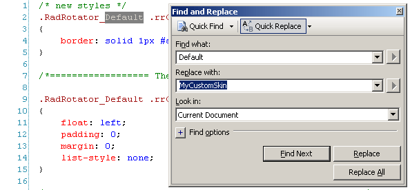
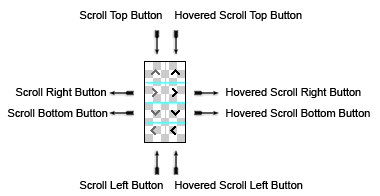
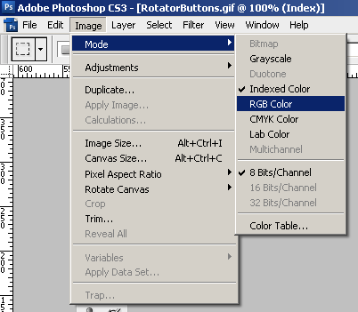
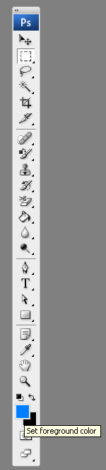
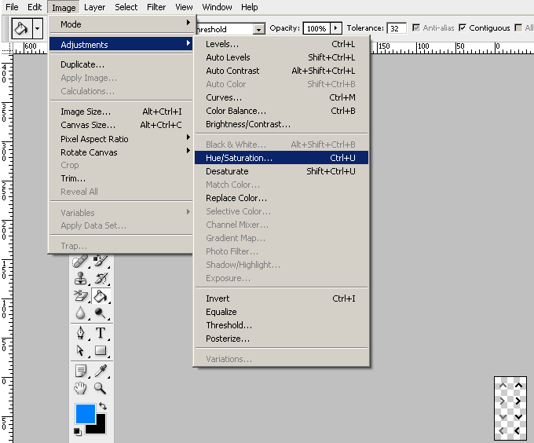
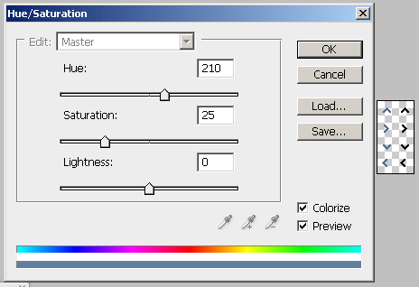
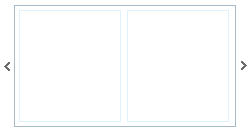
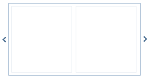

# Create a Custom Skin from an Existing One

## Abstract

Each of the controls included in the Telerik UI for ASP.NET AJAX suite is styled with two css files that are loaded in a certain order. The first one - ControlName.css, also called **base stylesheet** contains CSS properties and values that are common for all skins, i.e it is layout-specific, not skin-specific. These are CSS float, padding, margin, font-size, font-family, etc. In the general case, when creating a custom skin for a control this file should not be edited, unless the custom skin needs different sizes, paddings or margins.

The second file represents the actual skin of the control, and its name consists of the control name plus the skin name, i.e - Rotator.Default.css. Upon creating a custom skin for the control, one should edit that particular file, as it contains skin-specific CSS properties, and references to images, colors, borders and backgrounds.

## Creating a Custom Skin for RadRotator for ASP.NET AJAX from an Existing One

### Getting and Renaming Files and CSS Classes

In order to explain better the CSS classes of RadRotator, we will use both Rotator.css and Rotator.SkinName.css as external resources. We will modify an existing skin of RadRotator. Follow these steps to register an external skin for RadRotator for ASP.NET AJAX before editing any CSS:

1. In your project, create a new directory named **Skins**

1. In the skins folder create a new directory **MyCustomSkin**.

1. Go to **~/[TelerikControlsInstallationFolder]/Skins** and copy **Rotator.css** in your **Skins** folder

1. Go to **~/[TelerikControlsInstallationFolder]/Skins/Default** and copy **Rotator.Default.css** and the **Skins/Default/Rotator** folder in your **Skins** folder.

1. Rename Rotator.**Default**.css to Rotator.**MyCustomSkin**.css and the folder **Default** to **MyCustomSkin**.

1. When you are finished you should have: Skins/Rotator.css, Skins/MyCustomSkin/Rotator.MyCustomSkin.css and Skins/MyCustomSkin/Rotator. The last folder contains the images for MyCustomSkin.

1. In order to support multiple skins of RadRotator on a single page, the wrapping skin-specific class is coined by the name of the control, RadRotator plus underscore ("_") plus SkinName, i.e **.RadRotator_Default**, so in order to create a custom skin out of the Default skin, we should rename all occurences of "**Default**" in Rotator.MyCustomSkin.css to "**MyCustomSkin**" as shown below:

	

1. Put a new server declaration of RadRotator on your page, and set **Skin="MyCustomSkin", EnableEmbeddedSkins="false"** and **EnableEmbeddedBasestylesheet="false"**:

	**ASP.NET**

		<telerik:RadRotator ID="RadRotator1" runat="server" Skin="MyCustomSkin" EnableEmbeddedSkins="false"
			EnableEmbeddedBaseStylesheet="false">
		</telerik:RadRotator>

1. Register Rotator.css and Rotator.MyCustomSkin.css in the <head>...</head> section of your web page. In order to have the CSS applied correctly, the base stylesheet should come first in the DOM:

	**ASP.NET**

		<link rel="stylesheet" type="text/css" href="Skins/Rotator.css"></link>
		<link rel="stylesheet" type="text/css" href="Skins/MyCustomSkin/Rotator.MyCustomSkin.css"></link>

	Make sure the path to the files is correct, otherwise the skin will not apply.

1. Reload the page, and if the steps 0-9 have been followed correctly, you will see RadRotator running a custom Default skin set as an external resource.

### Explanation of the CSS Classes in Rotator.css and Rotator.MyCustomSkin.css

#### The Base Stylesheet - Rotator.css

**Main CSS Classes**

* **.RadRotator** - primary wrapping class of RadRotator

* **.rrRelativeWrapper** - secondary wrapping class of RadRotator

* **.rrClipRegion** - the wrapping class of RadRotator's items list

* **.rrClipRegion .rrItemsList** - RadRotator's items list

* **.rrClipRegion .rrItemsList li** - single item in RadRotator's items list

* **.RadRotator ul.rrVerticalList** - vertical list of RadRotator's items

* **.RadRotator .rrVerticalList li** - single list of vertical list of RadRotator's items

* **.rrButton** - scroll button

* .**rrButton:hover** - scroll button hovered state

* **.rrButton.rrButtonUp** - scroll up button

* **.rrButton.rrButtonRight** - scroll right button

* **.rrButton.rrButtonDown** - scroll down button

* **.rrButton.rrButtonLeft** - scroll left button

* **.rrButton.rrButtonDisabled** - disabled scroll button in which the disabled appearance is achieved with opacity

* **.rrNoBorder .rrClipRegion** - - the wrapping class of RadRotator's items list in no-bordered RadRotator

* **html* .rrVerticalList li** - special setting for RadRotator's vertical list for Internet Explorer 6

#### The Skin Stylesheet - Rotator.MyCustomSkin.css

Each skin of RadRotator consists of an [image sprite](http://www.alistapart.com/articles/sprites/), that is contained in the Skins/SkinName/Rotator folder:

1. RotatorButtons.gif - the normal and hover states of the buttons:

	

	Each button is a 20 x 20 pixels square. On the left row is the normal state of the buttons, on the second - the hovered state. In the CSS they are selected from the sprite via the [background-position](http://www.w3schools.com/css/pr_background-position.asp) property.

1. CSS Classes that are used in in **The Skin Stylesheet - Rotator.SkinName.css:**

	* **.RadRotator_Default .rrClipRegion** - the wrapping class of RadRotator's items list

	* **.RadRotator_Default .rrClipRegion .rrItemsList** - RadRotator's items list

	* **.RadRotator_Default .rrButton** - RadRotator button

	* **.RadRotator_Default .rrButton.rrButtonUp** - scroll up button

	* **.RadRotator_Default .rrButton.rrButtonUp:hover** - hovered scroll up button

	* **.RadRotator_Default .rrButton.rrButtonRight** - scroll right button

	* **.RadRotator_Default .rrButton.rrButtonRight:hover** - hovered scroll right button

	* **.RadRotator_Default .rrButton.rrButtonDown** - scroll down button

	* **.RadRotator_Default .rrButton.rrButtonDown:hover** - hovered scroll down button

	* **.RadRotator_Default .rrButton.rrButtonLeft** - scroll left button

	* **.RadRotator_Default .rrButton.rrButtonLeft:hover** - hovered scroll left button

	* **.RadRotator_Default .rrButton.rrButtonDisabled** - disabled scroll button in which the disabled appearance is achieved with opacity

### Understanding the Image Sprite

Below is a visual schemes of the image sprites that are used to skin RadRotator.

RotatorButtons.gif

### Modifying the Image Sprite to Achieve Totally New Looks for the Skin

Explained below is a simple method for modifying the image sprite of RadRotator's buttons with [Adobe© PhotoShop](http://adobe.com) to achieve new looks without creating a new design.

1. Drag RotatorButtons.gif in [Adobe© PhotoShop](http://adobe.com)

1. From the menu bar select **Image » Mode » RGB Color** to prepare the image for editing (convert from optimized **Indexed Color** to **RGB Color**):

	

1. Press **Set Foreground Color** in PhotoShop's toolbox to invoke the color picker dialog:

	

1. Select a color that you like from the color dialog and then close it:

	

1. Choose the first image you will modify, for example WindowHorizontalSprites.gif, and select **Image » Adjustments Hue » / Saturation to open the Hue / Saturation** dialog of [Adobe© PhotoShop](http://adobe.com):

	

1. Check the **colorize** checkbox in the Hue / Saturation dialog, and the image you have selected will be immediately colorized in the hue you have selected from the toolbox:

	
	
	You may then play with the Hue, Saturation and Lightness sliders to fine tune or further modify the image. Make sure you memorize the values of the sliders, as you will need to add the same settings to all three images in order to achieve consistent looks

1. Press "OK" when you are finished

1. Select Image **Image » Mode » Indexed Color** to flatten the layers of the image

1. Save and close the image

1. Repeat Steps 5 - 9 for each of the remaining images

1. After you are over and done with this, save your work and reload the page. You will have a brand new skin based on [Telerik](http://www.telerik.com)'s Default skin of RadRotator.

	

	
