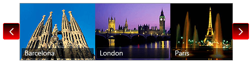

# Customize the Appearance of Control Buttons


## 

The buttons of __RadRotator__ are styled with CSS3 since the Q2 2014 release of UI for ASP.NET AJAX. The new stylization of the buttons is supported by IE10+ and the rest of the modern browsers. This allows you to easily modify the appearance of the buttons in a custom skin for the rotator control.__Example 1__ shows how to create a custom CSS class that modifies the styles of the rotator in order to achieve the appearance in __Figure 1__ .
>caption Figure 1: RadRotator with customized buttons appearance.



__Example 1__: The CSS rules that change the default RadRotator buttons to result in Figure 1.

````ASPNET
	    <telerik:RadRotator ID="RadRotator1" runat="server" Skin="MyCustomSkin" EnableEmbeddedSkins="false"
	        EnableEmbeddedBaseStylesheet="false">
	    </telerik:RadRotator>
````


When you create the custom CSS class __customButtons__ you need to set it to the rotator via its __CssClass__ property. You can choose a different name for the class and replace __customButtons__ with it in __Example 1__.

__Example 2__: Applying the custom CSS class from Example 1 to a __RadRotator__.

````ASPNET
	    <telerik:RadRotator ID="RadRotator1" runat="server" RotatorType="Buttons" CssClass="customButtons"
	        Height="113px" ItemHeight="113px" Width="490px" ItemWidth="150px">
	        <ItemTemplate>
	            ...
	        </ItemTemplate>
	    </telerik:RadRotator>
````


# See Also

 * [RadRotator - Elastic capabilities]()

 * [RadRotator - Creating a Custom Skin from an Existing One]()

 * [RadRotator - RadRotator's CSS classes]()
