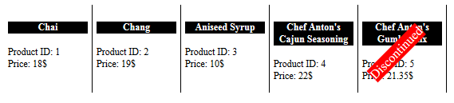

# OnClientTemplateDataBound


This article demonstrates how the __OnClientTemplateDataBound__ event can be used to manipulate the HTML code of the item before rendered in the browser.

## 

This event is raised when the data from the request is received and the HTML of the current item in the Rotator is properly evaluated.

The event handler receives two parameters:

1. The __RadRotator__ instance that fired the event.

1. An event arguments object containing the following methods:

* __get_dataItem()__ - returns the client-side data object bound to the Rotator item.

* __get_html()__ - returns the HTML the Rotator is about to render.

* __get_template()__ - returns the template the RadRotator uses.

* __set_html(string)__ - sets a new HTML that will be placed in the Rotator item.

__Figure 1__ and __Example 1__ demonstrates how to use the methods of the event arguments object to	dynamically manipulate the HTML that is going to be rendered.
>caption Figure 1: The rendered Rotator items modified via the OnClientTemplateDataBound event



__Example 1__: Using the __OnClientTemplateDataBound__ event's arguments in client-side logic.


````ASPNET
		<telerik:RadClientDataSource runat="server" ID="RadClientDataSource1" PageSize="5" AllowPaging="true">
			<DataSource>
				<WebServiceDataSourceSettings BaseUrl="http://demos.kendoui.com/service/">
					<Select Url="Products" DataType="JSONP" />
				</WebServiceDataSourceSettings>
			</DataSource>
		</telerik:RadClientDataSource>
	
		<telerik:RadRotator runat="server" ID="Rotator" ClientDataSourceID="RadClientDataSource1"
			Width="560" Height="150" ItemWidth="100" ItemHeight="100" OnClientTemplateDataBound="OnClientTemplateDataBound">
			<ClientTemplate>
	        <h4 class="productName">#= ProductName #</h4>
			<div class="productId"><span>Product ID: </span>#= ProductID #</div>
			<div class="price"><span>Price: </span>#= UnitPrice #$</div>
			</ClientTemplate>
		</telerik:RadRotator>
	
		<script type="text/javascript">
			function OnClientTemplateDataBound(sender, args) {
				var product = args.get_dataItem();
				var isDiscontinued = product.Discontinued;
	
				if (isDiscontinued) {
					var oldHtml = args.get_html();
					var newHtml = '<div class="discontinued">Discontinued</div>' + oldHtml;
					args.set_html(newHtml);
				}
			}
		</script>
````
````HTML
		<style type="text/css">
			.rrItem {
				border-right: 1px solid black;
				padding: 5px;
			}
	
			.rrItem .productName {
				text-align: center;
				background-color: black;
				color: white;
			}
	
			.discontinued {
				-webkit-transform: rotate(-45deg);
				-moz-transform: rotate(-45deg);
				-ms-transform: rotate(-45deg);
				-o-transform: rotate(-45deg);
				position:absolute;
				background-color:red;
				color:white;
				font-size:16px;
				top:50px;
			}
		</style>
````


# See Also

 * [Client-side Data Binding]()
