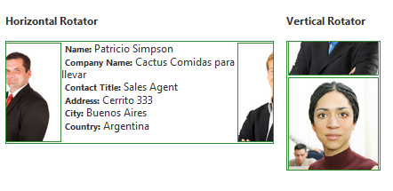

# Binding to ASP DataSource Components

**RadRotator** supports binding to all ASP.NET 2.0 DataSource components, including

* AccessDataSource

* SqlDataSource

* XmlDataSource

* ObjectDataSource

* SiteMapDataSource

* LinqDataSource

To bind to a DataSource component, all you need to do is set the **DataSourceID** property of the rotator to the ID of the DataSource component.

Bind to **SqlDataSource**

````ASP.NET
<asp:SqlDataSource ID="SqlDataSource1" runat="server" ConnectionString="<%$ ConnectionStrings:ConnectionString %>"
	SelectCommand="SELECT * FROM [Customers] WHERE Country = 'Argentina' OR Country = 'Austria' OR Country = 'Belgium' OR Country = 'Canada' OR Country = 'Denmark' OR Country = 'Finland' OR Country = 'Mexico' OR Country = 'Norway'">
</asp:SqlDataSource>
<telerik:RadRotator RenderMode="Lightweight" ID="RadRotator1" runat="server" Width="305px" Height="114px"
	ScrollDuration="500" FrameDuration="2000" ItemHeight="110" ItemWidth="100" DataSourceID="SqlDataSource1">
	<ItemTemplate>
		<asp:Image ID="CustomerImage" runat="server" ImageAlign="Left" ImageUrl='<%# String.Format("~/Img/Northwind/Customers/Thumbs/{0}.jpg", DataBinder.Eval(Container.DataItem, "CustomerID")) %>' />
	</ItemTemplate>
</telerik:RadRotator>
````

Bind to **XmlDataSource**

````ASP.NET
<telerik:RadRotator RenderMode="Lightweight" ID="RadRotator1" RotatorType="AutomaticAdvance" ScrollDirection="Up"
	ScrollDuration="2000" runat="server" DataSourceID="XmlDataSource1" Width="500"
	Height="200" FrameDuration="0">
	<ItemTemplate>
		<div class="module" style="width: 500px">
			<strong><a href='<%# XPath("link") %>' target="_blank">
				<%# XPath( "title") %></a></strong>
			<%# XPath( "pubDate") %>
		</div>
	</ItemTemplate>
</telerik:RadRotator>
<asp:XmlDataSource ID="XmlDataSource1" XPath="rss/channel/item" runat="server" DataFile="http://www.telerik.com/support.rss">
</asp:XmlDataSource>
````

The **AccessDataSource** is a table-based **DataSource** component. It can be used to bind the rotator declaratively at design time.

````ASP.NET
<asp:AccessDataSource runat="server" ID="AccessDataSource1" DataFile="~/App_Data/Nwind.mdb"
	SelectCommand="SELECT * FROM [Customers]   WHERE Country = 'Argentina' OR Country = 'Austria' OR Country = 'Belgium' OR Country = 'Canada' OR Country = 'Denmark' OR Country = 'Finland' OR Country = 'Mexico' OR Country = 'Norway'">
</asp:AccessDataSource>
````

Both rotators from the screenshot below are bound to this data source



````ASP.NET
<telerik:RadRotator RenderMode="Lightweight" ID="RadRotator1" runat="server" DataSourceID="AccessDataSource1"
	Width="300px" Height="114px" ScrollDirection="Right" RotatorType="AutomaticAdvance">
	<ItemTemplate>
		<div style="width: 300px; height: 110px;">
			<asp:Image ID="CustomerImage" runat="server" ImageAlign="Left" ImageUrl='<%# String.Format("~/Rotator/Img/Northwind/Customers/Thumbs/{0}.jpg", DataBinder.Eval(Container.DataItem, "CustomerID")) %>'
				CssClass="RotatorItem" />
			<span class="title">Name: </span>
			<asp:Label CssClass="info" ID="Name" runat="server" Text='<%# DataBinder.Eval(Container.DataItem, "ContactName") %>'>          
			</asp:Label>
			<br />
			<span class="title">Company Name:</span>
			<asp:Label CssClass="info" ID="cName" runat="server" Text='<%# DataBinder.Eval(Container.DataItem, "CompanyName")%>'></asp:Label>
			<br />
			<span class='title'>Contact Title:</span>
			<asp:Label CssClass="info" ID="Label1" runat="server" Text='<%# DataBinder.Eval(Container.DataItem, "ContactTitle")%>'></asp:Label>
			<br />
			<span class='title'>Address:</span>
			<asp:Label CssClass="info" ID="Label2" runat="server" Text='<%# DataBinder.Eval(Container.DataItem, "Address")%>'></asp:Label>
			<br />
			<span class='title'>City:</span>
			<asp:Label CssClass="info" ID="Label3" runat="server" Text='<%# DataBinder.Eval(Container.DataItem, "City")%>'></asp:Label>
			<br />
			<span class='title'>Country:</span>
			<asp:Label CssClass="info" ID="Label4" runat="server" Text='<%# DataBinder.Eval(Container.DataItem, "Country")%>'></asp:Label>
		</div>
	</ItemTemplate>
</telerik:RadRotator>
````

````ASP.NET
<telerik:RadRotator RenderMode="Lightweight" ID="RadRotator2" runat="server" DataSourceID="AccessDataSource1"
	RotatorType="AutomaticAdvance" Width="104px" Height="144px" ScrollDirection="Down">
	<ItemTemplate>
		<asp:Image runat="server" ID="Image" ImageUrl='<%# String.Format("~/Rotator/Img/Northwind/Customers/Thumbs/{0}.jpg", DataBinder.Eval(Container.DataItem, "CustomerID")) %>'
			CssClass="RotatorItem" AlternateText="Customer Image" />
	</ItemTemplate>
</telerik:RadRotator>
````

# See Also

 * [Binding RadTicker]()
